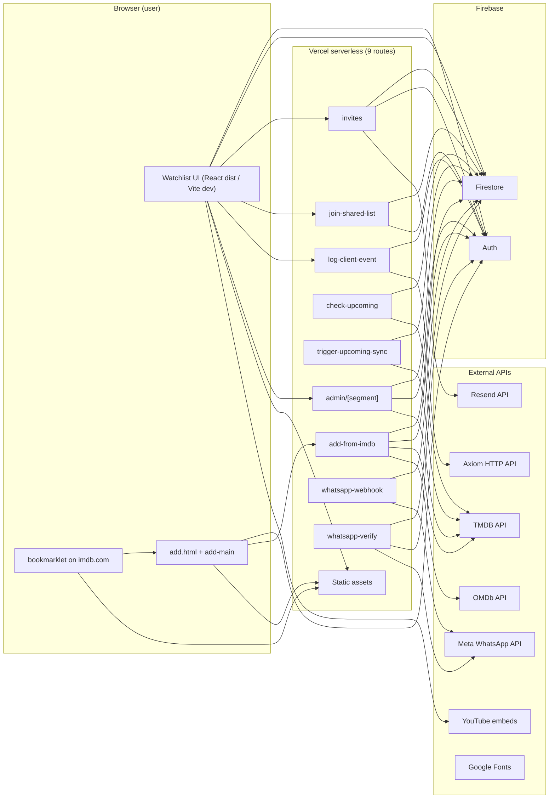
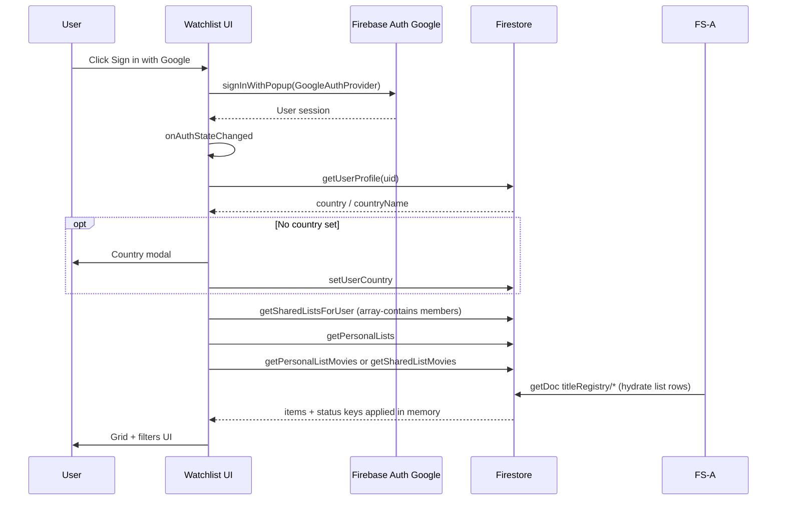
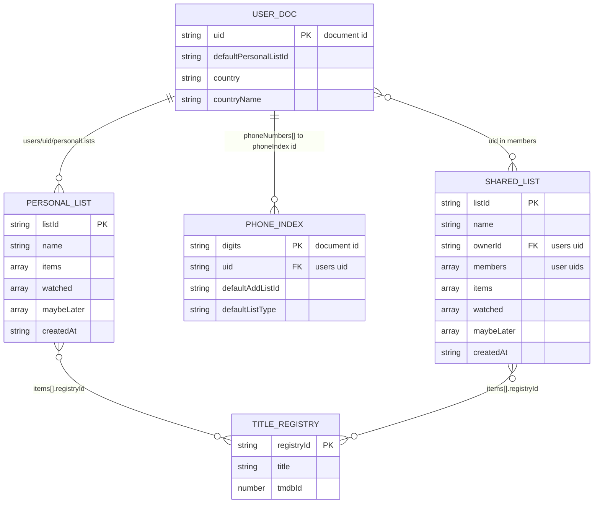
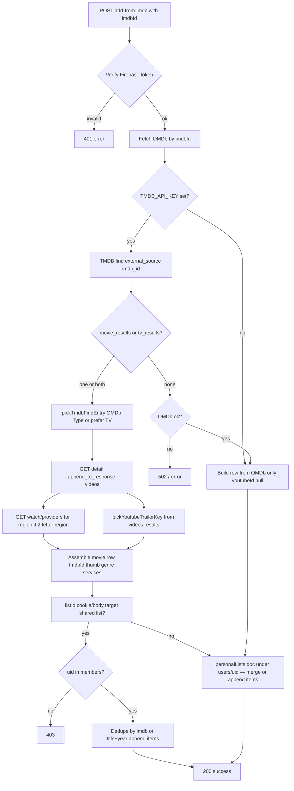

# System Design Document

This document describes the **Watchlist** app — **only what exists in this repository** (static site, Vercel **`api/*`** serverless routes, Firestore rules, Firebase client module, and operational scripts). It does not specify future or assumed behavior. **Firebase** and **GCS** resource names may still use the legacy id **`movie-trailer-site`** (unchangeable). **GitHub** repository **`maulbogat/watchlist`** (formerly **`maulbogat/watchlist-app`**; GitHub redirects the old remote). **Vercel** dashboard links in **Admin** use project slug **`watchlist`** unless you change them in **`AdminPage.tsx`**.

---

## Section 1: Services & External Dependencies

| Service name | Purpose | How it's accessed | Authentication | Environment variables |
|--------------|---------|-------------------|----------------|----------------------|
| **Firebase (Firestore)** | Persist watchlists, shared lists, **`titleRegistry`**, **`phoneIndex`**, **`verificationCodes`**, **`meta/jobConfig`** + **`meta/usageStats`**, user profile (country, list name, linked phone ids). | **Client:** Firebase JS SDK v10 in `src/firebase.ts` (`getFirestore`, `doc`, `getDoc`, `setDoc`, etc.), bundled by Vite. **Server:** `firebase-admin` in **`api/*`** routes and Node scripts. | **Client:** Firebase Auth user JWT (SDK attaches to requests per Firestore rules). **Server:** Service account JSON (base64) for Admin SDK. | **Client:** `VITE_FIREBASE_*` variables (read in `src/config/firebase.ts` via `import.meta.env`). **Server/scripts:** `FIREBASE_SERVICE_ACCOUNT` (base64 JSON). Scripts may also use `serviceAccountKey.json` in project root (per README / `check-upcoming.mjs`). |
| **Firebase Auth** | Google Sign-In for end users. | **Client:** Firebase Auth SDK from npm (`signInWithPopup`, `GoogleAuthProvider`, `onAuthStateChanged`) in `src/firebase.ts` (bundled by Vite; not a CDN script tag). | OAuth via Google; Firebase-issued ID tokens. | Same Firebase client env vars (`VITE_FIREBASE_*`). |
| **Firebase Analytics** | Optional; skipped when **offline**, in **Vite dev** (`import.meta.env.DEV`), or when blocked. | **Client:** `src/firebase.ts` dynamically imports Analytics only if `shouldLoadWebAnalytics()` passes, then `isSupported()` + `getAnalytics(app)` (avoids Installations `app-offline` noise locally). | Inherits Firebase web app setup. | Uses the same `VITE_FIREBASE_*` values. |
| **The Movie Database (TMDB)** | Resolve IMDb id → TMDB id; poster; genres/year; **YouTube trailer key** from appended `videos`; **watch providers** by region. | **REST:** `https://api.themoviedb.org/3/...` via Node `https.get` in `api/add-from-imdb.js`. Same pattern in maintenance scripts (e.g. `scripts/sync-services-from-tmdb.js`, `check-upcoming.mjs` uses `fetch`). **Not** called from the browser watchlist UI. | API key query parameter `api_key`. | `TMDB_API_KEY` in Vercel env / `.env` for local scripts / `check-upcoming.mjs`. |
| **OMDb** | Title metadata by IMDb id; disambiguate movie vs TV when TMDB returns both; fallback row when TMDB has no match. | **REST:** `https://www.omdbapi.com/?i=...&apikey=...` in `add-from-imdb.js` and various scripts. | API key query parameter. | `OMDB_API_KEY` (Vercel + local scripts per README / `.env.example`). |
| **YouTube** | Trailer playback in modal via iframe embed. | **Browser:** `https://www.youtube-nocookie.com/embed/{youtubeId}?...` and link to `youtube.com/watch`. | None for embed (public video ids). | None. |
| **Google Fonts** | Watchlist title/body faces (**Bebas Neue**, **DM Sans**) via **`styles.css`** **`--font-title`** / **`--font-body`**. | `<link href="https://fonts.googleapis.com/...">` in **`index.html`**. | None. | None. |
| **Geist (npm)** | **Geist Variable** for shadcn / component UI (`@theme` in **`styles.css`**). | **`@import "@fontsource-variable/geist"`** in **`styles.css`** (bundled by Vite). | None. | None. |
| **maulbogat.com** | Verified **From** domain for invite email. | DNS at **Cloudflare Registrar**; domain + DNS records verified in **Resend** for outbound mail. | — | — |
| **Google Cloud Storage** | Daily native **Firestore export** for **disaster recovery**. Bucket **`movie-trailer-site-backups`** (**europe-west1**). **Retention:** **30-day** lifecycle rule auto-deletes old exports. | **Cloud Scheduler** job **`firestore-daily-export`** at **4am UTC** daily (Firestore Admin export API; not this repo’s Vercel app or GitHub Actions JSON workflow). **Restore:** `gcloud firestore import gs://movie-trailer-site-backups/{folder}`. | **OAuth** token via **`firestore-scheduler`** service account. | None (configured in Google Cloud Console only). |
| **Vercel** | Replaces **Netlify** for this project: static **`dist/`**, **9** serverless API routes (root **`api/*.js`** and **`api/admin/[segment].js`**), **Cron** **`/api/check-upcoming`** (**`vercel.json`** `0 3 * * *` = **03:00 UTC**); **Hobby** default is **12** serverless function slots — confirm capacity if you stay on that tier. | **Browser:** same-origin **`fetch`** to **`/api/*`**. **Server:** handlers wrapped by **`src/api-lib/vercel-adapter.js`** (Netlify-shaped handler compatibility, Node **`req`/`res`**). | Routes verify Firebase ID token where required. | `FIREBASE_SERVICE_ACCOUNT`, `OMDB_API_KEY`, `TMDB_API_KEY`, optional `UPCOMING_SYNC_TRIGGER_SECRET`, optional **`FIRESTORE_HOURLY_READ_LIMIT`**, **`FIRESTORE_DAILY_READ_LIMIT`**, optional **`WHATSAPP_VERIFY_TOKEN`**, **`WHATSAPP_APP_SECRET`** (required for webhook POST), **`WHATSAPP_TOKEN`**, **`WHATSAPP_PHONE_NUMBER_ID`**, optional **`RESEND_API_KEY`**, **`RESEND_FROM_EMAIL`**, optional **`APP_PUBLIC_URL`** / **`VERCEL_URL`**, optional **`VERCEL_API_TOKEN`**, **`VERCEL_PROJECT_ID`** (Admin deployment status), optional **`GITHUB_TOKEN`**, optional **`GITHUB_REPO`** (default **`maulbogat/watchlist`**) (Admin GitHub Actions card), optional **`VITE_APP_ORIGIN`**, optional **`SENTRY_DSN`**, optional **`VITE_SENTRY_DSN`**; no `VITE_AXIOM_*`. |
| **Resend** | Transactional email for **app invitations** only (`POST /api/invites` `action: send`). | **Server:** HTTPS `POST https://api.resend.com/emails` from **`src/api-lib/resend-send.js`**. **Not** called from the browser. | API key in `Authorization: Bearer`. | **`RESEND_API_KEY`**; **`RESEND_FROM_EMAIL`** (e.g. **`noreply@maulbogat.com`** when domain verified; code falls back to **`onboarding@resend.dev`** if unset). |
| **Axiom** | Log search / observability via **direct HTTP ingest** (not a Netlify log drain). | **Client:** **`src/lib/axiom-logger.ts`** → **`POST /api/log-client-event`** (Firebase ID token). **Server:** **`src/api-lib/logger.js`** → Axiom HTTP API when **`AXIOM_TOKEN`** / **`AXIOM_DATASET`** are set; otherwise **`console.log`** JSON. | Client: Firebase ID token. Server: Axiom token. | **`AXIOM_TOKEN`**, **`AXIOM_DATASET`** (server-only; often omitted locally). |
| **Sentry** | Error tracking and (when enabled) performance traces + **session replay on errors only** for the SPA; server-side capture on **`add-from-imdb`** and **`whatsapp-webhook`** only; **Admin** unresolved-issue count via **`GET /api/admin/external-status?service=sentry`**. | **Client:** **`@sentry/react`** in **`src/main.tsx`** (init only when **`VITE_SENTRY_DSN`** is set; **`enabled`** in **production** builds only), **`Sentry.withErrorBoundary`** around **`App`**, **`useAuthUser`** sets **`Sentry.setUser({ id: uid })`** on sign-in and **`setUser(null)`** on sign-out (**never** email or display name). **Server:** **`@sentry/node`** via **`src/api-lib/sentry-node.js`** when **`SENTRY_DSN`** is set; **`captureException`** in those two API routes’ failure paths. **Admin API:** Sentry REST with **`SENTRY_READ_TOKEN`**. **Build:** optional **`@sentry/vite-plugin`** when **`SENTRY_AUTH_TOKEN`** is set (source maps + **`SENTRY_ORG`** / **`SENTRY_PROJECT`** for the plugin). | DSN-based ingest; read token for issues API; org auth token for source map upload only. | **`VITE_SENTRY_DSN`** (client; optional). **`SENTRY_DSN`** (server; optional). Optional **Admin issues card:** **`SENTRY_READ_TOKEN`**, **`SENTRY_PROJECT`** (API project slug, org **`maulbogat`**). Optional CI/build: **`SENTRY_AUTH_TOKEN`**, **`SENTRY_ORG`**, **`SENTRY_PROJECT`** (Vite plugin). |
| **Meta (WhatsApp Cloud API)** | Webhook verification (GET) and inbound text (POST); outbound text replies after verify/add flows. | **Server:** **`api/whatsapp-webhook.js`**, **`api/whatsapp-verify.js`**, **`src/api-lib/whatsapp-graph.js`**. **Not** called from the browser. | **`WHATSAPP_VERIFY_TOKEN`**; **`WHATSAPP_APP_SECRET`** for **`x-hub-signature-256`** HMAC on **raw** POST body (**403** if missing/invalid — no Firestore); **`WHATSAPP_TOKEN`** + **`WHATSAPP_PHONE_NUMBER_ID`** for sending. In-memory **5 msgs / sender / 60s** rate limit (**200** when exceeded, logged as **`whatsapp.rate_limit`**). | Same WhatsApp env vars as above. |

**Note:** `.env` is for server/script vars (`process.env`) and `.env.local` is for client Vite vars (`import.meta.env`). The live add flow uses the signed-in user’s Firestore `country` (via `getUserProfile` in `src/add-main.ts`), not `WATCH_REGION`, when calling **`/api/add-from-imdb`**. For Vercel vs Vite variable placement and sensitive keys, see **[`docs/environment.md`](./docs/environment.md)**.

---

## Section 2: Architecture Overview

**Browser (client-side)**  
- **Watchlist UI — React + TypeScript + Vite:** Root **`index.html`** loads **`#root`** and **`/src/main.tsx`**. **`src/main.tsx`** mounts **Sonner** **`Toaster`** (**`import { Toaster } from "sonner"`**, **`theme="dark"`**, **`position="bottom-right"`**) next to **`QueryClientProvider`** for **`toast.error` / `toast.success`** (replacing **`window.alert`** in grid, trailer modal, list management, join, onboarding rename). Optionally initializes **Sentry** (**`@sentry/react`**) when **`VITE_SENTRY_DSN`** is set (production-only reporting) and wraps **`App`** with **`Sentry.withErrorBoundary`** (token-based fallback UI in **`styles.css`**). **`npm run dev:react`** / **`npm run build:react`**; Vercel publishes **`dist/`** from **`npm run build:react`** (**`vercel.json`**). **`src/App.tsx`** routes include **`/join/:listId`** (**`JoinPage`**), **`/join-app/:inviteId`** (**`JoinAppPage`**), **`/admin`**, and the signed-in watchlist shell (**`WatchlistAuthGate`** → **`AllowlistGate`** → **`WatchlistPage`**). **`AccessDeniedScreen`** replaces the app when the user is not on **`allowedUsers`** (except **`/join-app/*`** where they can sign in and accept). **`src/firebase.ts`** (Firebase JS SDK from npm, bundled by Vite) initializes App, Auth, Firestore, optional Analytics; list CRUD uses the same module; **`checkUserAllowed`** reads **`allowedUsers`**. **`src/store/useAppStore.ts`** (Zustand) + **`src/store/watchlistConstants.ts`**. **`src/hooks/useWatchlist.ts`** (TanStack Query) loads lists; **`useAuthUser.ts`** → **`onAuthStateChanged`** (**`WatchlistAuthGate`** and **`AdminRouteShell`** render **`AuthLoadingSplash`** — full-viewport **`/watchlist-mark.svg`**, **`.splash-screen`** in **`styles.css`** — until the first auth callback). **`WatchlistPage.tsx`**: **`ListSelector`**, **`WatchlistToolbar`**, **`ManageListsModal`** (lists + email invites; no in-modal bookmarklet or paste-to-join), auth menu (**WhatsApp** → **`WhatsAppSettings`**, **Bookmarklet** → **`BookmarkletSettings`**), **`CountryModal`**, **`src/components/modals/*.tsx`**, **`UpcomingAlertsBar`**, filters, **`TitleGrid`** / **`TitleCard`**, **`TrailerModal`**. Session restore **`useWatchlistSessionRestore.ts`**; **`src/lib/watchlistFilters.ts`**, **`bookmarkletCookie.ts`**, **`storage.ts`**, **`movieDisplay.ts`**, **`utils.ts`**, **`src/data/lists.ts`**, **`src/hooks/useMutations.ts`**. **`src/main.tsx`** warns if **`#root`** is missing.
- All routine Firestore access uses the **signed-in user’s** Firebase session and **`firestore.rules`**.  
- **`add.html`** + **`src/add-main.ts`** — bookmarklet popup: auth, POST **`/api/add-from-imdb`**, `postMessage` handshake.  
- **`public/bookmarklet.js`** on **imdb.com** opens **`https://watchlist.maulbogat.com/add.html?imdbId=…&embed=1`** in a popup (**Cloudflare** DNS for **`maulbogat.com`**; **`watchlist`** **CNAME** → **Vercel**). The script **hardcodes** that production origin for the popup URL and for **`postMessage`** validation (same host only). For local dev it also accepts **`http(s)://localhost`** with any port so **`vercel dev`** / Vite can serve **`add.html`**; users who install the bookmark from **`/bookmarklet.html`** get the deployed script. Changing the public host requires editing **`public/bookmarklet.js`**, redeploying, and updating Firebase **Authentication → Authorized domains**.

**Design system (`styles.css` + Cursor)**  
- **`styles.css`** **WATCHLIST DESIGN SYSTEM** **`:root`** tokens: **`--color-*`**, **`--text-*`**, **`--radius-*`**, **`--space-*`**, plus **`--watchlist-genre-popover-border`** for the genre filter popover edge. **Geist Variable** is imported from **`@fontsource-variable/geist`** for the shadcn / **`@theme`** layer; **Bebas Neue** / **DM Sans** load from Google Fonts in **`index.html`** for **`--font-title`** / **`--font-body`**.  
- Four button bases: **`.btn-primary`**, **`.btn-secondary`**, **`.btn-ghost`**, **`.btn-destructive`** — legacy button class names stay wired through comma-grouped selectors so older rules still layer correctly.  
- **`.cursorrules`** enforces token/button usage for styling, documents modal/header patterns, and requires README, **system-design.md**, **docs/environment.md**, and **`.env.example`** updates when features, API routes, collections, or env vars change; it also sets Vitest expectations for new pure utilities in **`src/lib/`**.  
- **Lint / format:** Root **`eslint.config.js`** (flat config): **`@eslint/js`** recommended, **`typescript-eslint`** recommended for **`src/**/*.{ts,tsx}`**, **`eslint-plugin-react-hooks`** (**`recommended-latest`**), **`eslint-plugin-react-refresh`**, **`eslint-plugin-prettier`** + **`eslint-config-prettier`**; **`src/**/*.js`** uses core recommended with Node globals. Ignores **`dist/`**, **`node_modules/`**, **`backups/`**, **`scripts/`**, **`src/components/ui/`**. **`npm run lint`** / **`lint:fix`**. **Prettier** (**`.prettierrc`**, **`.prettierignore`**) — **`npm run format`** / **`format:check`** on **`src/`**.  
- **Watchlist toolbar:** **`WatchlistToolbar.tsx`** uses a two-row layout (primary: status tabs, type, sort, search; secondary: genre **Radix Popover** via **`src/components/ui/popover.tsx`**, **Added by** segmented control on shared lists). Genre list styling: **`watchlist-genre-popover-*`** in **`styles.css`**; sort still uses **Radix Select**.

**Migration note (Netlify → Vercel)**  
Serverless code moved from **`netlify/functions/`** to root **`api/*.js`**. **`src/api-lib/vercel-adapter.js`** preserves Netlify-shaped handler wiring on Vercel’s **`(req, res)`** model. Scheduled jobs use **`vercel.json`** Cron only (legacy **`netlify.toml`** was removed from the repo). Full local dev uses two processes: **`npm run dev:react`** (Vite) and **`vercel dev --listen 3000`** (API + **`process.env`**).

**Vercel (`api/*`)**  
- **Static hosting** for HTML, CSS, JS, SVG assets from **`dist/`**.  
- **Serverless API routes** (root **`api/*.js`** including **`api/admin/[segment].js`** for **`/api/admin/*`**, **`vercel.json`** rewrites + cron **`/api/check-upcoming`**):  
  - `add-from-imdb.js` — verifies token; **`src/api-lib/firestore-guard.js`** **`checkFirestoreQuota(db, 10)`** before Firestore work; calls OMDb/TMDB, writes Firestore via Admin SDK; after a successful add with `tmdbId`, runs **upcoming alerts** sync for that title (`src/api-lib/sync-upcoming-alerts.js`). On **`QuotaExceededError`**, responds **503** (no list write).  
  - `join-shared-list.js` — verifies token; requires a **pending** `invites` row whose **`invitedEmail`** matches the token email and **`listId`** matches the request (not expired, **`usedAt`** null); then **`arrayUnion(uid)`** on **`sharedLists/{listId}.members`** and marks that invite used. Returns **403** **`invite_required`** when no such invite exists.  
  - `invites.js` — single function: **GET** lists pending invites for caller; **POST** `{ action: "send", invitedEmail, listId? }` creates invite + Resend email; **POST** `{ action: "accept", inviteId }` allowlists user and optional shared list; **DELETE** `{ inviteId }` revokes if caller is inviter.  
  - `check-upcoming.js` — **cron** (3:00 UTC, **`vercel.json`**): **`checkFirestoreQuota(db, 50)`** before sync; runs chunked sync (`runRegistrySyncWithTimeBudget`) over **`titleRegistry`**, writes to `upcomingAlerts`, `upcomingChecks`, and `syncState/upcomingAlerts`, and writes latest run status to `meta/jobConfig`. Uses shared logic in **`src/api-lib/execute-upcoming-sync.js`** and respects `meta/jobConfig.checkUpcomingEnabled` for scheduled runs (manual runs still proceed). Recognizes **`x-vercel-cron`** like Netlify’s **`x-netlify-event`**. On quota exceed, records **skipped** in **`meta/jobConfig`** and returns a skipped JSON payload (**not** **503**).  
  - `trigger-upcoming-sync.js` — **HTTP** (GET/POST) manual trigger for the same upcoming sync as `check-upcoming`. Optional env **`UPCOMING_SYNC_TRIGGER_SECRET`** + `Authorization: Bearer …`. **`checkFirestoreQuota(db, 50)`**; on exceed returns **503**.  
  - `log-client-event.js` — POST authenticated client events to **Axiom** (server-only `AXIOM_*`).  
  - `admin/[segment].js` — consolidated **Admin** API (**one** serverless function). Segments: **`external-status`** — `GET ?service=github|vercel|gcs|axiom|sentry` with **`Authorization: Bearer`** Firebase ID token + admin UID (same behavior as former **`external-status.js`**: GitHub Actions latest run for **`backup.yml`**, Vercel latest deployment, GCS export folder freshness in **`movie-trailer-site-backups`**, Axiom **24h** tabular summary on **`watchlist-prod`**, Sentry unresolved issue count); **`job-config`** — GET/POST **`meta/jobConfig`** (toggle **`checkUpcomingEnabled`** / **`githubBackupEnabled`**; no Firebase user token verification); **`catalog-orphans`** — **`GET`**, Bearer + admin UID, orphan scan via **`catalog-orphan-scan.cjs`** (cap **1500**); **`delete-registry-orphan`** — **`POST`** **`{ registryId }`**, re-scan + delete if still unreferenced; **`catalog-health`** — **`POST`** **`{ imdbId }`**, TMDB thumb backfill (**`TMDB_API_KEY`**). Unknown segment → **404**.  
  - `whatsapp-webhook.js` — **GET:** Meta subscription verification (`hub.verify_token` vs `WHATSAPP_VERIFY_TOKEN`). **POST:** missing or invalid **`x-hub-signature-256`** HMAC of the **raw** body (read from the Node stream, not Vercel’s pre-parsed **`req.body`**) → **403** immediately (**no** Firestore). After verification: in-memory **5** messages per sender per **60** s — over limit returns **200** with no processing; logged as **`whatsapp.rate_limit`**. Then **`checkFirestoreQuota(db, 10)`**; on exceed, user may get a short WhatsApp reply and **200**. Otherwise parse JSON, extract IMDb id; if sender maps in **`phoneIndex`**, call shared **`add-from-imdb`** logic as that user + default list; reply via Graph API (**200** on handled POSTs so Meta does not aggressively retry).  
  - `whatsapp-verify.js` — **POST** + Firebase ID token: send or verify **6-digit** link code, write **`phoneIndex`** and **`users.phoneNumbers`** via Admin SDK; uses **`verificationCodes`** and **`src/api-lib/phone-index.js`**.    
- **`src/api-lib/firestore-guard.js`** — exports **`checkFirestoreQuota(db, estimatedReads)`** and **`QuotaExceededError`**. Runs a Firestore **transaction** on **`meta/usageStats`**, applying hourly/daily caps (**`FIRESTORE_HOURLY_READ_LIMIT`** / **`FIRESTORE_DAILY_READ_LIMIT`**, defaults **5000** / **45000**). Throws **`QuotaExceededError('hourly')`** or **`QuotaExceededError('daily')`** when the projected read count would exceed the active window after resets. Called from **`whatsapp-webhook`**, **`add-from-imdb`**, **`check-upcoming`**, **`trigger-upcoming-sync`** (see per-route bullets above).
- Routes use **Firebase Admin** with `FIREBASE_SERVICE_ACCOUNT` where needed; they bypass Firestore security rules by design.
- **`api/package.json`** sets `"type": "commonjs"` so handlers stay CommonJS while the repo root `package.json` is `"type": "module"`.

**Firebase**  
- **Authentication:** Google provider; users identified by `uid`.  
- **Firestore:** Collections documented in Section 3. Rules in `firestore.rules`: **`titleRegistry` read for signed-in users, no client writes**; `users/{uid}` and `users/{uid}/personalLists/*` scoped to owner; `sharedLists` readable/writable only by members (with create requiring creator in `members`); `upcomingAlerts` read for any signed-in user, no client writes; `syncState` and **`verificationCodes`** denied to clients; **`phoneIndex`** readable/writable only when **`resource` / `request` `uid` matches** the signed-in user (owner-scoped rows); **`allowedUsers/{email}`** read only when path email (lowercased) matches the signed-in user’s token email (lowercased), no client writes; **`invites`** read for any signed-in user, no client writes (Admin + invite APIs only). **`match /meta/{docId}`** — **read** allowed only for **admin UIDs** (hardcoded in **`firestore.rules`**, aligned with **`src/config/admin.ts`**); **no** client writes (Admin SDK writes **`jobConfig`**, **`usageStats`**, etc.). Paths without a rule (for example **`upcomingChecks`**) remain denied. (Legacy **`catalog`** is removed from rules; delete leftover docs with `scripts/delete-legacy-catalog.mjs`.)

**External APIs — where invoked**  
- **TMDB / OMDb:** from **`api/add-from-imdb.js`** (POST), **`api/admin/[segment].js`** segment **`catalog-health`** (Admin thumb backfill), and from **local Node scripts**; not from the main watchlist grid UI.  
- **Meta WhatsApp:** from **`api/whatsapp-webhook.js`** and **`api/whatsapp-verify.js`** (server only).  
- **Resend:** from **`invites.js`** (send action) via **`src/api-lib/resend-send.js`** (server only).  
- **Sentry:** **Browser** — **`src/main.tsx`** + **`useAuthUser`** (**`uid`** only in user context). **Server** — **`api/add-from-imdb.js`** and **`api/whatsapp-webhook.js`** via **`src/api-lib/sentry-node.js`** when **`SENTRY_DSN`** is set. **Admin** — **`GET /api/admin/external-status?service=sentry`** when **`SENTRY_READ_TOKEN`** + **`SENTRY_PROJECT`** are set.  
- **GitHub Actions / Vercel / GCS / Axiom / Sentry:** from **`api/admin/[segment].js`** segment **`external-status`** (admin-only, Firebase ID token + admin UID) for **`?service=github`**, **`?service=vercel`**, **`?service=gcs`**, **`?service=axiom`** (Axiom APL query to **`watchlist-prod`** with **`AXIOM_TOKEN`**), and **`?service=sentry`** (Sentry REST with **`SENTRY_READ_TOKEN`** + **`SENTRY_PROJECT`**).  
- **YouTube:** browser loads embed URLs; no YouTube Data API key in repo.  
- **No** TMDB calls from the watchlist UI for watch providers or enrichment at runtime; chips use data already on each item (`services`, `servicesByRegion`).

---

## Section 3: Data Model

### `catalog` (**removed**)

Legacy collection is **not** used by the app or scripts anymore. **Rules** no longer include `catalog`. Remove any remaining documents with `node scripts/delete-legacy-catalog.mjs --write` (after backup).

---

### `titleRegistry` / `{registryId}`

Canonical metadata per title (one doc per stable id). **Writes:** Admin SDK only (`add-from-imdb`, migration scripts). **Reads:** Any signed-in user.

**Payload shape (merge writes):** **`api/add-from-imdb.js`** calls **`payloadForRegistry`** (**`src/lib/registry-id.ts`** / **`src/api-lib/registry-id.cjs`**) before **`titleRegistry/{id}.set(..., { merge: true })`**. That helper **omits** **`status`** and **`registryId`** from the written object (the document id is the canonical id; status is list-scoped only). All other merged keys are persisted. TMDB-enriched adds set the fields below; **OMDb-only** fallback (no TMDB match) still sets **`imdbId`**, **`title`**, **`year`**, **`type`**, **`genre`**, **`thumb`**, **`youtubeId`** (usually **`null`**), and **`services`** (`[]`) but **does not** set **`tmdbId`**, **`tmdbMedia`**, or **`originalLanguage`** until a later merge. **`servicesByRegion`** is **not** written by **`add-from-imdb`**; it may be merged by scripts (e.g. **`scripts/sync-services-from-tmdb.js`**). Older docs may still carry legacy keys removed by maintenance (**`scripts/cleanup-legacy-fields.mjs`**, etc.).

| Field | Type | Notes |
|-------|------|--------|
| `title` | `string` | Display title from TMDB or OMDb. |
| `year` | `number` or null | Release / first-air year when parseable. |
| `type` | `"movie"` \| `"show"` | TV is stored as **`"show"`** (aligned with client **`MediaType`**). |
| `genre` | `string` | Often **`"Genre1 / Genre2"`** (TMDB); OMDb **`Genre`** string as returned. |
| `thumb` | `string` (URL) or null | TMDB **`poster_path`** as w500 base URL (**`add-from-imdb`**) or OMDb **`Poster`** when not **`N/A`**. |
| `youtubeId` | `string` or null | TMDB trailer key; stored only if it matches YouTube’s **11-character** id pattern (**`/^[a-zA-Z0-9_-]{11}$/`** in **`add-from-imdb`**, same idea as **`src/lib/youtube-trailer-id.ts`**). |
| `imdbId` | `string` | Normalized with **`tt`** prefix in the add flow. |
| `tmdbId` | `number` | Present when **TMDB** enrichment succeeds; absent / unchanged on OMDb-only rows until merged. |
| `tmdbMedia` | `"tv"` \| `"movie"` | TMDB media kind for **`tmdbId`** (TV **`show`** → **`"tv"`**). |
| `services` | `array` of `string` | Watch **provider names** for the user’s **watch region** at add time (TMDB **`watch/providers`**); empty array when unknown or OMDb-only. |
| `servicesByRegion` | `object` or null | Optional map **`{ "IL": ["Netflix", …], … }`**; populated by maintenance scripts, not by **`add-from-imdb`**. |
| `originalLanguage` | `string` or null | ISO **639-1**, **lowercase**, from TMDB **`original_language`** when TMDB enrichment runs. |
| `listStatus` | `'to-watch'` \| `'watched'` \| `'archive'` \| `'maybe-later'` \| null | Highest-priority status across all lists. Written by client mutations. Used by `check-upcoming` to skip archived titles. Priority: `archive` > `watched` > `to-watch` > `maybe-later`. |

The field table reflects the **intended** schema from the **`add-from-imdb`** enrichment path. Individual documents may carry **additional** legacy or script-applied keys not listed here — the table is the **write-path contract**, not a guarantee of document shape.

**Maintenance:** **`scripts/backfill-tmdb-media.mjs`** sets missing **`tmdbMedia`** from **`type`** (`movie` → `movie`, `show` → `tv`) for a curated list of docs; default dry run, **`--write`** to merge. **`scripts/backfill-original-language.mjs`** sets missing **`originalLanguage`** from TMDB **`original_language`** for every **`titleRegistry`** doc with a usable **`tmdbId`** (and **`tmdbMedia`** / **`type`** for movie vs TV); uses **`TMDB_API_KEY`** + Admin; default dry run, **`--write`** to merge; **`--force`** overwrites existing **`originalLanguage`**. **`scripts/cleanup-legacy-fields.mjs`** removes **`addedByUid`**, **`addedByDisplayName`**, **`addedByPhotoUrl`** from a fixed set of registry docs via Admin **`update`** + **`FieldValue.delete()`**; default dry run, **`--write`** to apply. **`scripts/backfill-thumb.mjs`** fills missing **`thumb`** from TMDB **`poster_path`** (w500) for a fixed list; uses **`TMDB_API_KEY`** and Admin from **`.env`** / **`serviceAccountKey.json`**; default dry run, **`--write`** to merge.

**`registryId` (document id) and list keys:** The id is **`registryDocIdFromItem`** in **`src/lib/registry-id.ts`** (client) / **`src/api-lib/registry-id.cjs`** (API): prefer normalized IMDb id (`tt…`), else **`tmdb-tv-{id}`** / **`tmdb-movie-{id}`** when **`tmdbId`** is known, else deterministic **`legacy-{hash}`** from **`title|year`**. For **status arrays** (**`watched`**, **`maybeLater`**) and legacy rows, the same module’s **`listKey`** returns **`registryId`** when the row has it, otherwise **`title|year`**. The old **`movieKey`** export was removed; **`listKey`** is the single helper.

**List rows** in **`sharedLists`** / **`personalLists`** use the canonical **`{ registryId, addedAt }`** shape after migration (shared rows may add **`addedBy*`** — see **List row in Firestore** below). Status arrays use the **`listKey`** string (usually equal to **`registryId`**). Per-user display overrides can attach here or on list rows in a future version.

---

### `users` / `{uid}`

| Field | Type | Notes |
|-------|------|--------|
| `defaultPersonalListId` | `string` | Firestore id of the **default** personal list doc under `users/{uid}/personalLists/{id}`. Set when the user names their main list or when legacy data is migrated. |
| `country` | `string` | ISO 3166-1 alpha-2 (e.g. `"IL"`) for TMDB watch region when adding titles. |
| `countryName` | `string` | Human-readable country name for UI. |
| `upcomingDismissals` | `map` | Optional. Keys = alert **fingerprints** (e.g. `136311_3_9`, `12345_sequel_999`); values = ISO date string when the user dismissed that pill. Used so dismissed upcoming notifications stay hidden until a new fingerprint appears. |
| `phoneNumbers` | `array` of string | Optional. **Digits-only** ids (same as **`phoneIndex`** document ids) for WhatsApp-linked numbers; maintained with **`arrayUnion` / `arrayRemove`** when linking or removing in **`WhatsAppSettings`**. |
| `displayName` | `string` or null | Denormalized from Firebase Auth via **`syncUserDisplayNameToFirestore`** in **`src/firebase.ts`**. Used for **”added by”** display on shared lists. Readable by **any signed-in user** per **`firestore.rules`**. |
| `photoURL` | `string` or null | Synced from Firebase Auth **`photoURL`**. Used for avatar display on shared lists. |
| `favorites` | `map` | Keys are `registryId` strings, values are `true`. Personal per-user — never shared. Written by client SDK via `toggleFavorite()`. Used by the favorites filter toggle and as a weight multiplier for the recommendation engine. |

**Legacy (removed after migration):** `items`, `watched`, `maybeLater`, `archive`, `listName` on the user root doc were moved into the default `personalLists` subdoc. The client and `add-from-imdb` run a one-time migration; optional bulk script: `scripts/migrate-personal-items-to-subcollection.mjs`.

**Relationship:** Parent for subcollection `personalLists`. Referenced by `sharedLists.members` and `sharedLists.ownerId`.

**Queries / access:** `doc(db, "users", uid)` get/set; no compound queries on `users` in client code beyond single-doc read.

---

### `users` / `{uid}` / `personalLists` / `{listId}`

| Field | Type | Notes |
|-------|------|--------|
| `name` | `string` | **Required** non-empty when creating a subcollection list; stored trimmed. |
| `items` | `array` | Same **Item object** shape as **`sharedLists`** rows (`{ registryId }` after migration). |
| `watched`, `maybeLater` | `array` of string | Status keys (`listKey` strings), same pattern as `sharedLists`. |
| `createdAt` | `string` (ISO) | Set on create. |

**Relationship:** All personal list **content** lives here (including the default list). The app uses virtual `listId === "personal"` for the list whose real id is `users/{uid}.defaultPersonalListId`.

---

### `sharedLists` / `{listId}`

| Field | Type | Notes |
|-------|------|--------|
| `name` | `string` | **Required** non-empty when creating; `join-shared-list` rejects new joins if missing (legacy lists without a name must be renamed in-app first). |
| `ownerId` | `string` | Firebase `uid` of creator. |
| `members` | `array` of string | Uids with access; creator included on create. |
| `items` | `array` | **Item objects** (no `status` stored in Firestore; status derived from key sets). |
| `watched`, `maybeLater` | `array` of string | Status keys; titles in `items` but in neither array are **To Watch** (includes **maybe-later** in the UI tab). |
| `createdAt` | `string` (ISO) | |

**Relationship:** Many-to-many via `members` (users can be in multiple lists).

**Indexed / queried:** Client uses `query(collection(db, "sharedLists"), where("members", "array-contains", uid))` in `getSharedListsForUser`. **`firestore.indexes.json`** includes a composite index on **`invites`** (`invitedEmail`, `usedAt`) for server-side invite queries. Firebase may auto-index simple `array-contains` queries or prompt in console if needed.

---

### `allowedUsers` / `{email}`

**Document id:** Lowercased, trimmed email (same normalization as **`normalizeUserEmailKey`** in **`src/firebase.ts`** and invite APIs).

| Field | Type | Notes |
|-------|------|--------|
| `uid` | `string` | Firebase uid after the user accepts (set by **`POST /api/invites`** `action: accept`). |
| `invitedBy` | `string` | Inviter uid or sentinel (e.g. seed **`self`**). |
| `invitedAt` | `string` (ISO) | From invite creation or seed time. |
| `acceptedAt` | `string` (ISO) | When invite was accepted or seeded. |

**Writes:** Admin SDK only (**`/api/invites`** accept path, **`scripts/seed-allowed-users.mjs`**). **Reads:** Owner may read their own row (`firestore.rules`). **`AllowlistGate`** uses **`checkUserAllowed`** before loading watchlist Firestore UX.

---

### `invites` / `{inviteId}`

| Field | Type | Notes |
|-------|------|--------|
| `invitedEmail` | `string` | Normalized lowercase. |
| `invitedBy` | `string` | Inviter uid. |
| `listId` | `string` or null | Optional shared list to join on accept. |
| `createdAt` | `string` (ISO) | |
| `expiresAt` | `string` (ISO) | Typically seven days from creation. |
| `usedAt` | `string` (ISO) or null | Set when accepted. |
| `usedBy` | `string` or null | Accepter uid. |

**Writes:** Admin SDK only (**`/api/invites`** send/accept/revoke paths). **Reads:** Any signed-in user per rules (UI uses **`GET /api/invites`** instead of direct client queries for listing).

---

### `syncState` / `upcomingAlerts` (single doc)

**Writes:** Admin SDK only. Holds **`lastRegistryDocId`** (cursor into `titleRegistry` ordered by document id), **`registryDocCount`** (from Firestore `count()` — invalidates cursor when the registry size changes), **`lastPruneAt`**, and timestamps so `check-upcoming` can sync in **multiple short serverless invocations** (each capped by host limits; **`vercel.json`** sets **60s** for heavy routes). Legacy **`nextIndex`** may still exist in old docs until the next sync clears it. Clients cannot read or write (`firestore.rules`).

### `upcomingChecks` / `{tmdbId_media}`

Admin-only per-title state used by upcoming sync skip logic.

| Field | Type | Notes |
|-------|------|--------|
| `tmdbId` | `number` | TMDB id for the title row. |
| `media` | `"tv"` \| `"movie"` | Media kind used by sync logic. |
| `lastCheckedAt` | `string` (ISO) | Last successful check timestamp. |
| `releaseDate` | `string` or null | Movie release date from TMDB (`YYYY-MM-DD`) when known. |
| `hasCollection` | `boolean` or null | Movie `belongs_to_collection != null` snapshot. |
| `collectionId` | `number` or null | TMDB collection id when present. |
| `updatedAt` | `string` (ISO) | Last state write timestamp. |

### `meta` / `jobConfig`

Admin-only runtime config + status for scheduled jobs.

| Field | Type | Notes |
|-------|------|--------|
| `checkUpcomingEnabled` | `boolean` | Controls whether scheduled `check-upcoming` runs execute or skip. |
| `githubBackupEnabled` | `boolean` | When **`false`**, **`scripts/backup-firestore.js`** (GitHub Actions backup) exits immediately without exporting; missing or **`true`** runs the backup as usual. |
| `lastRunAt` | `string` (ISO) | Last run attempt timestamp. |
| `lastRunStatus` | `string` or null | `success`, `error`, or `skipped`. |
| `lastRunMessage` | `string` or null | Human-readable summary/error. |
| `lastRunResult` | `map` or null | Last payload from sync result. |
| `lastRunTrigger` | `string` or null | Trigger source (`POST`, cron header, etc.). |
| `updatedAt` | `string` (ISO) | Last config/status write timestamp. |

### `meta` / `usageStats`

Firestore **read-quota** counters for **`src/api-lib/firestore-guard.js`**. **Writes:** Admin SDK only (inside **`checkFirestoreQuota`** transactions). **Reads:** Admin dashboard via **`getFirestoreUsageStats`** in **`src/firebase.ts`** (rules allow **admin UIDs** only on **`meta/*`**).

| Field | Type | Notes |
|-------|------|--------|
| `readsToday` | `number` | Count after last daily reset (UTC date change). |
| `readsThisHour` | `number` | Count after last hourly reset (UTC hour change). |
| `lastResetDate` | `string` | `YYYY-MM-DD` (UTC) when **`readsToday`** was last zeroed. |
| `lastResetHour` | `number` | UTC hour **0–23** when **`readsThisHour`** was last aligned. |
| `updatedAt` | `string` (ISO) | Last transaction write. |

Daily and hourly buckets reset inside the guard transaction on the next write when the calendar day or UTC hour advances.

### `meta` / `catalogHealthExclusions`

Optional. **Writes:** Admin SDK or Console only (no client writes in rules). **Reads:** Admin UIDs only (**`meta/*`** rule). Used by **Admin → Data Quality** (`catalogStatsQ` in **`src/pages/AdminPage.tsx`): registry rows whose **imdb id** appears in **`missingTmdbId`** are omitted from the **missing `tmdbId`** count and detail list (e.g. titles with no TMDB listing). If the document is absent, no ids are excluded.

| Field | Type | Notes |
|-------|------|--------|
| `missingTmdbId` | `array` of `string` | IMDb ids (`tt…`) to exclude from missing-`tmdbId` stats; compared case-insensitively. |

### `upcomingAlerts` / `{docId}`

Top-level collection. **Writes:** Admin SDK only (**`/api/check-upcoming`** — Vercel Cron + manual POST, and **`/api/add-from-imdb`** single-title sync). **Reads:** Any signed-in user (`firestore.rules`).

Document id examples: `tv_136311_3_9`, `mv_12345_sequel_67890`. Fields include:

| Field | Type | Notes |
|-------|------|--------|
| `catalogTmdbId` | `number` | TMDB id of the catalog row this alert was built from (same as list item after merge). |
| `media` | `"tv"` \| `"movie"` | Matches list classification (`show` → tv). |
| `fingerprint` | `string` | Dismissal / identity key (e.g. `136311_3_9`, `12345_sequel_999`, `12345_upcoming`). |
| `tmdbId` | `number` | Same as `catalogTmdbId` in current implementation (show in list). |
| `type` | `"tv"` \| `"movie"` | Same as `media`. |
| `alertType` | `string` | `new_episode`, `upcoming_movie`, `sequel`. (Legacy `new_season` / TBA “returning” rows are no longer written.) |
| `title`, `detail` | `string` | UI copy. |
| `airDate` | `string` or null | `YYYY-MM-DD` when known; may be null on very old docs. |
| `confirmed` | `bool` | `true` for newly synced rows (TBA returning alerts are not created). |
| `expiresAt` | `string` | `YYYY-MM-DD`; expired docs deleted by the scheduled job. |
| `sequelTmdbId` | `number` or null | For `sequel` alerts. |
| `detectedAt` | `timestamp` | Server time on upsert. |

**Client:** `src/firebase.ts` → `fetchUpcomingAlertsForItems` (chunks `catalogTmdbId` / `sequelTmdbId` `in` queries), `dismissUpcomingAlert` merges into `users/{uid}.upcomingDismissals`. **`UpcomingAlertsBar.tsx`** (UI label **Up next**): horizontal **cards** for the **currently loaded list** — poster thumbnail, title, episode/release **detail**, **`airDate`** in gold, **dismiss**, and **Add to calendar** (all-day **`.ics`**) when `airDate` is `YYYY-MM-DD`. Shows the **first four** matches; **Show more** expands inline to a grid, **Show less** collapses. A **skeleton** strip renders while data loads; the section is **hidden** when there are no alerts. **`src/lib/storage.ts`** caches fetched alerts per user + list fingerprint (**2**-hour TTL) to skip redundant Firestore reads. Sync never writes undated/TBA rows; the client drops any alert without a parseable date (legacy junk).

**Admin queries:** Composite `(catalogTmdbId, media)` may be required for `deleteStaleAlertsForRow`; Firebase console may prompt to create an index on first scheduled run.

---

### List row in Firestore (`items` array)

**Current (canonical normalized shape):** **`{ registryId, addedAt }`** — **`registryId`** is the stable id (`tt…`, `tmdb-tv-…` / `tmdb-movie-…`, or `legacy-…`). Metadata lives in **`titleRegistry/{registryId}`**; the client merges on read (**`src/firebase.ts`** → **`hydrateListItemsFromRegistry`**). **`addedAt`** (ISO string) is set when writing via **`rowToStore`** / **`ensureAddedAt`**.

**Shared list `items` only:** Rows written by **`add-from-imdb.js`** using **`toStoredRegistryRef`** may **also** include optional denormalized member fields (not used on **personal** list rows):

| Field | Type | Notes |
|-------|------|--------|
| `addedByUid` | `string` or null | Firebase **`uid`** of the member who added the title to the shared list. |
| `addedByDisplayName` | `string` or null | Denormalized display name at write time. |
| `addedByPhotoUrl` | `string` or null | Denormalized photo URL at write time. |

**Legacy (pre-migration):** full embedded objects with the same fields as **`titleRegistry`** docs; still supported until **`scripts/migrate-to-title-registry.mjs`** is run.

**Registry / hydrated fields** (from `titleRegistry` or legacy embed): On the wire, **`titleRegistry`** documents follow the **Field** table under **`titleRegistry` / `{registryId}`** above (plus optional keys from merges/scripts). After **`hydrateListItemsFromRegistry`** (**`src/firebase.ts`**), each row also carries:

| Field | Type | Notes |
|-------|------|--------|
| `registryId` | `string` | Present on hydrated client objects; not stored inside the registry document body (**`payloadForRegistry`** strips it; doc id is canonical). |
| `addedAt` | `string` (ISO) | On list rows from **`rowToStore`** / **`ensureAddedAt`**; may appear on merged registry reads when present on list rows. |

**Runtime-only:** `status` (`to-watch` \| `watched` \| `maybe-later`) is **computed in memory** when loading lists, from `watched` / `maybeLater` key arrays keyed by **`listKey`** (see **`titleRegistry`** section above). Legacy documents may still contain an **`archive`** array until **`scripts/strip-archive-field.mjs`** is run; the app ignores it.

**Data cleanup:** Run **`node -r dotenv/config scripts/strip-archive-field.mjs --write`** (after **`--dry-run`**) to remove **`archive`** from all **`sharedLists`** and **`personalLists`** docs. Titles that were only archived remain in **`items`** and appear as **To Watch**.

---

### `phoneIndex` / `{digits}`

**Document id:** digits only (no `+`), aligned with WhatsApp Cloud API `from` and **`phoneIndexDocId`** in **`src/api-lib/phone-index.js`**.

**Writes:** Owner via client (**`firebase.ts`**: `addUserPhoneNumber`, `removeUserPhoneNumber`, `setWhatsAppDefaultListForPhone`) when rules allow; Admin SDK in **`whatsapp-verify.js`** during code verification.

**Reads:** Owner only (`firestore.rules`). Server webhook uses Admin SDK to resolve sender → **`uid`** + default list.

| Field | Type | Notes |
|-------|------|--------|
| `uid` | `string` | Firebase user who verified the number. |
| `defaultAddListId` | `string` | Personal list subdoc id or shared list id. |
| `defaultListType` | `"personal"` \| `"shared"` | Which list type **`defaultAddListId`** refers to. |
| `updatedAt` | `string` (ISO) | Last write. |

---

### `verificationCodes` / `{e164Phone}`

**Document id:** E.164-style phone string (digits, same key as **`phoneIndex`** / WhatsApp **`from`** normalization in **`whatsapp-verify.js`**).

**Writes / reads:** Admin SDK only (`whatsapp-verify.js`). **15**-minute **`expiresAt`**; doc removed after successful verify or failed send. **No** client access (`firestore.rules` deny all).

| Field | Type | Notes |
|-------|------|--------|
| `code` | `string` | Six-digit verification string. |
| `uid` | `string` | Firebase uid requesting the code. |
| `defaultAddListId` | `string` | Target list id from verify request. |
| `defaultListType` | `string` | `"personal"` or `"shared"`. |
| `expiresAt` | `string` (ISO) | Code expiry. |
| `createdAt` | `string` (ISO) | Creation time. |

---

## Section 4: User Flows

### 1. Sign in flow

1. User opens the site (**deployed `dist/` from Vercel**, or **`npm run dev:react`** locally).  
2. User clicks “Sign in with Google”.  
3. **`src/App.tsx`** calls `signInWithPopup(auth, GoogleAuthProvider)` (custom parameter `prompt: "select_account"`). Firebase Auth sessions are **per origin** (host + port); local dev on a different port than production is a separate session. **`auth/unauthorized-domain`** is handled in UI (add the host in Firebase Console → Authentication → Authorized domains).  
4. Firebase Auth completes Google OAuth; `onAuthStateChanged` fires with a user.  
5. **`WatchlistPage`** loads profile / lists via React Query and **`useWatchlistSessionRestore`** (`/join/:listId` plus legacy `?join=` redirect, last list, filter prefs from **`storage.ts`**).  
6. List data: `getPersonalListMovies` / `getSharedListMovies` via **`src/firebase.ts`**.  
7. **`TitleGrid`** / **`TitleCard`** render the grid; filters persisted per uid in **`localStorage`**.

### 2. Add title via IMDb bookmarklet flow

1. User drags bookmarklet from **`public/bookmarklet.html`** (bookmark is a `javascript:` URL that injects **`public/bookmarklet.js`** from the deployed origin).  
2. On an IMDb title page, user runs bookmarklet: validates pathname `/title/ttxxxx`.  
3. Script opens popup to **`https://watchlist.maulbogat.com/add.html?imdbId=…&embed=1`** (origin hardcoded in **`public/bookmarklet.js`**; must stay aligned with Firebase **Authorized domains**).  
4. **`src/add-main.ts`** validates IMDb id; subscribes to `onAuthStateChanged`.  
5. If not signed in: show error; `postMessage` to parent/opener; optionally close popup.  
6. If signed in: read `getUserProfile` for `watch_region`; read optional `listId` from cookie `bookmarklet_list_id` (shared list) and optional `personalListId` from cookie `bookmarklet_personal_list_id` (current personal list’s real subdoc id, set by the main app).  
7. `fetch("/api/add-from-imdb", { POST, Authorization: Bearer <getIdToken()> })` with body `{ imdbId, watch_region, listId?, personalListId? }`.  
8. **`/api/add-from-imdb`** verifies token → `uid`; loads OMDb; if `TMDB_API_KEY` present, runs TMDB find + detail + videos + watch providers; else falls back to OMDb-only row; writes to `sharedLists/{listId}` or `users/{uid}/personalLists/{personalListId}` (default id from profile if cookie absent); migrates legacy `users/{uid}.items` on first write when needed.  
9. Response JSON returned; add page displays message; `postMessage({ type: "add-result", ... })` to opener/parent; bookmarklet shows toast and closes popup.  
10. **Main watchlist tab does not automatically reload** from this flow; user refreshes or revisits to see new titles (unless they were already polling — they are not).

**Upcoming alerts sync (separate from bookmarklet):** Manual HTTP / `curl` should call `/api/trigger-upcoming-sync` (GET/POST) for long runs; **`/api/check-upcoming`** is for cron + Admin “Run now”. Both use `runRegistrySyncWithTimeBudget`.

### 3. TMDB enrichment flow (add path)

**Implemented in** `api/add-from-imdb.js` (POST) and conceptually:

1. Normalize IMDb id to `tt…`.  
2. Fetch OMDb by id (for type hint and fallback body).  
3. If `TMDB_API_KEY` set: **find** `/find/{imdb_id}?external_source=imdb_id`.  
4. Choose movie vs TV via `pickTmdbFindEntry` (OMDb `Type`, else prefer TV if both exist).  
5. **Detail** `/{movie|tv}/{id}?append_to_response=videos` → poster, title, year, genres, `videos.results`.  
6. Pick YouTube key: prefer Trailer → Teaser → Clip/Featurette → any YouTube on TMDB.  
7. If watch region present (2-letter): **watch providers** `/{type}/{id}/watch/providers`, flatten `flatrate`/`rent`/`buy` names for that region.  
8. If TMDB fails: build minimal row from OMDb only (`youtubeId: null`).  
9. Dedupe/merge into target list document; normalize `youtubeId` through 11-char validation before persist.

### 4. Shared list and app-invite flows

**Shared list — create:**  
1. Signed-in user opens list settings modal → “Create shared list”, enters name.  
2. `createSharedList(uid, name)` writes `sharedLists/{listId}` with `ownerId`, `members: [uid]`, empty arrays.  
3. **`SharedCreatedModal`** explains that the owner should use **Invite someone** in the same modal and select the new list (no shareable **`/join/{listId}`** URL in the UI).

**Shared list — join via `/join/{listId}`:**  
1. User opens site with **`/join/{listId}`** while signed in (legacy **`?join=`** links are redirected to the same path).  
2. Client **`POST`s `/api/join-shared-list`** with JSON **`{ listId }`**, `credentials: "include"`, and **`Authorization: Bearer`** when available — **`JoinPage`**. Function reads Firebase ID token from **`Authorization`** first, else **`bookmarklet_token`** cookie.  
3. Function verifies Firebase ID token. **Allowlisted app access alone is not sufficient:** there must be a **pending** **`invites`** row whose **`invitedEmail`** matches the token email and **`listId`** matches the request (not expired, **`usedAt`** null). Then **`arrayUnion(uid)`** on **`members`** and consumes the invite (**`usedAt` / `usedBy`**). **403** **`invite_required`** when no matching invite exists; **400** if the list has no non-empty **`name`** (unless already a member). **Existing allowlisted users** still need that emailed invite row for this list — same as new users on this path.  
4. Client refreshes shared lists, switches **`currentListMode`** to that shared list.

**App access — email invite:**  
1. Allowed user opens **Manage lists** → **Invite someone**, enters email and optional shared list, **`POST /api/invites`** with **`{ action: "send", … }`**.  
2. Server creates **`invites/{inviteId}`**, emails **`/join-app/{inviteId}`** (Resend).  
3. Invitee opens link: if not signed in, **`JoinAppPage`** prompts Google sign-in; when signed in, **`POST /api/invites`** with **`{ action: "accept", inviteId }`** adds **`allowedUsers/{email}`** and optional **`sharedLists`** membership, marks invite used.  
4. **`AllowlistGate`** then allows the main app; revoker uses **`DELETE /api/invites`** with **`{ inviteId }`**; pending rows from **`GET /api/invites`**.

### 5. Watch provider lookup flow

1. **At add time:** User’s `country` on `users/{uid}` is read in **`src/add-main.ts`** as `watch_region` and sent to `add-from-imdb`.  
2. **Server:** `enrichFromTmdb` fetches TMDB watch providers for that region and stores provider **names** on the new/merged item as `services` (array of strings).  
3. **At display time:** **`servicesForMovie(m, userCountryCode)`** in **`src/lib/movieDisplay.ts`** (used by **`TitleCard`** / **`TrailerModal`**) prefers `m.servicesByRegion[countryCode]`, else `m.services`.  
4. **Persisting region-specific cache:** no watchlist client helper; `services` / `servicesByRegion` are set at add time (**`/api/add-from-imdb`**) or by scripts.

### 6. WhatsApp → add title flow

1. User configures Meta’s webhook to **`/api/whatsapp-webhook`** and sets **`WHATSAPP_*`** env vars on Vercel (**`WHATSAPP_APP_SECRET`** required for POST).  
2. In the app, user opens profile menu → **WhatsApp** (**`WhatsAppSettings`** dialog): enters E.164 number, default list, **`POST /api/whatsapp-verify`** sends a code; user enters code; verify path writes **`verificationCodes`** (Admin) and **`phoneIndex`** + **`users.phoneNumbers`**.  
3. User sends a message containing an **IMDb URL** or **`tt…`** id to the WhatsApp business number.  
4. **`whatsapp-webhook` (POST):** validates **`x-hub-signature-256`** against the **raw** body stream (**403** if bad — **no** Firestore); enforces per-sender rate limit (**200** + log **`whatsapp.rate_limit`** when exceeded); runs **`checkFirestoreQuota(db, 10)`** before other Firestore work. Then resolves **`from`** → **`phoneIndex`**, loads **`users/{uid}.country`** for watch region, calls **`performAddFromImdbByUid`** (same core as bookmarklet) when applicable.  
5. Replies with a short **Graph API** text (added / duplicate / error / unregistered / no IMDb in message / quota messaging when triggered).

---

## Section 5: Component Map

| Name / file | Responsibility | Reads Firestore | Writes Firestore | External APIs |
|-------------|----------------|-----------------|------------------|---------------|
| `index.html` / `src/main.tsx` | Vite entry; **`<title>Watchlist`**, **Open Graph** / **Twitter** meta (production **`https://watchlist.maulbogat.com`**, **`/watchlist-og.svg`**), favicon links (**`/watchlist-mark.svg`**, **`/favicon-32x32.png`**, **`/favicon-16x16.png`**, **`/apple-touch-icon.png`**); optional **Sentry** init + **`withErrorBoundary`** when **`VITE_SENTRY_DSN`** is set; mounts React (`App` → routes → **`WatchlistAuthGate`** / **`JoinPage`** / **`JoinAppPage`** / **`AdminPage`**). | — | — | Google Fonts (from HTML); optional **Sentry** browser SDK |
| `src/pages/AdminPage.tsx` | Admin-only dashboard: **header** link **Switch to prod** / **Switch to local** (other admin tab; prod URL from **`VITE_APP_ORIGIN`** or default **`https://watchlist.maulbogat.com`**), **ACTIVITY (LAST 24H)** card (**`GET /api/admin/external-status?service=axiom`** — Axiom **`watchlist-prod`** aggregates), **SENTRY — LAST 24H** (**`?service=sentry`** — unresolved issue count), **Data Quality** (**`titleRegistry`** field-gap counts; **titles not on any list** — one header row (count + label left; **Scan now**; **Show/Hide** at far right when count **> 0**); **Scan now** whether or not a prior result is shown (including **`sessionStorage`** restore) → **`GET /api/admin/catalog-orphans`** (not on initial load); results held in TanStack Query + **`sessionStorage`** for the tab session; per-row remove (**`POST /api/admin/delete-registry-orphan`**) updates counts/list locally without re-scanning orphans; optional **`meta/catalogHealthExclusions`** filters missing-`tmdbId` stats; **Refresh** refetches **`titleRegistry`** stats only; Data Quality dropdowns with **0** items omit **Show/Hide** (static header); **0 titles not on any list** keeps the list visible while rows are exiting after delete), Firestore read-quota bars (**`meta/usageStats`** via **`getFirestoreUsageStats`**), **Upcoming Check Job** (**`checkUpcomingEnabled`** via **`GET`/`POST /api/admin/job-config`** via **`src/firebase.ts`**), **GitHub Backup** (workflow status **`/api/admin/external-status?service=github`**, optional server **`GITHUB_TOKEN`**; **scheduled JSON export** on/off via **`githubBackupEnabled`** on same **`job-config`** path), **GCS** + **Vercel** deployment status (Deployments card **Open deployments** → **`https://vercel.com/maulbogats-projects/watchlist/deployments`** unless **`VITE_DEPLOYMENTS_URL`** is set), **Service Links** (Vercel env vars, Meta WhatsApp console, Google Cloud billing + project dashboard + **GCS** **`movie-trailer-site-backups`** + **Cloud Scheduler** for **`firestore-daily-export`**, Firebase, etc.). | **`titleRegistry`** (client read + **`getCountFromServer`** / **`getDocs`** with field projection), **`meta/usageStats`**, **`meta/catalogHealthExclusions`** (admin UID), `fetch` to admin APIs | — | `fetch` → **`/api/admin/*`** (**`external-status`**, **`job-config`**, **`catalog-orphans`**, **`delete-registry-orphan`**); external HTTPS links |
| `src/components/WhatsAppSettings.tsx` | Dialog: list linked numbers, default list per number, connect flow; **`fetch`** → **`/api/whatsapp-verify`**. | Via `src/firebase.ts` | Via `src/firebase.ts` (`phoneIndex`, `users.phoneNumbers`) | WhatsApp verify API |
| `src/components/BookmarkletSettings.tsx` | Dialog: bookmarklet instructions + draggable control (opened from profile menu). | — | — | — |
| `src/components/AllowlistGate.tsx` | After sign-in, **`checkUserAllowed`** on **`allowedUsers`**; blocks watchlist children when denied. | `allowedUsers` | — | Firebase SDK |
| `src/components/AccessDeniedScreen.tsx` | Full-screen copy when user is not allowlisted (or email missing). | — | — | — |
| `src/components/TrailerModal.tsx` + `src/hooks/useMutations.ts` + `src/hooks/useWatchlist.ts` | Trailer **add-to-list** menu: rows are not globally disabled while a mutation is pending (back-to-back toggles, e.g. add to My list then remove from shared Our list, work without waiting on the network). **`listsContaining`** React Query uses a stable key (**title id + sorted list ids**), not list metadata **`dataUpdatedAt`**. **`listModeQueryKey`** treats **`{ type: "personal", listId: "personal" }`** like bare **`"personal"`** so optimistic writes hit the same **`watchlistMovies`** entry as the main grid (the modal passes object mode for every personal row; only the default list uses id **`"personal"`**). **`updateWatchlistCacheForMode`** uses **`prev ?? []`** so adding to a list that has never been loaded still updates cache + **`listsContaining`** patches. Remove mutations always patch **`listsContaining`** (not only when a row was removed from **`watchlistMovies`**) so shared-list checkmarks update when membership came from **`sharedLists[].items`** without a hydrated per-list query. **`useAddTitleToList`** patches **`listsContaining`** after a cache add; **`useRemoveTitleFromList`** / **`useRemoveTitle`** patch **`listsContaining`** on every remove attempt; on mutation error, **`listsContaining`** is invalidated for that title. Shared lists: membership prefers cached **`watchlistMovies`** for **`["shared", listId]`** when loaded, else **`sharedLists[].items`**. | Cache + **`getPersonalListMovies`** when a personal list has no cached rows | Indirect (same mutations as grid) | — |
| `src/pages/JoinAppPage.tsx` | Accept email invite: sign-in CTA or **`POST /api/invites`** (`action: accept`), then redirect. | — | — | Same-origin `fetch` |
| `src/components/*.tsx`, `src/components/modals/*.tsx`, `src/hooks/*` | React watchlist UI (see Architecture). | Via `src/firebase.ts` | Via `src/firebase.ts` | `fetch` → `join-shared-list`, **`/api/invites`**, `log-client-event`, admin functions where used; YouTube embeds; clipboard |
| `src/store/watchlistConstants.ts` | Status labels, checkmark/upcoming SVG snippets, `GENRE_LIMIT`. | — | — | — |
| `src/lib/movieDisplay.ts` | `servicesForMovie`, `renderServiceChips`, `hasPlayableTrailerYoutubeId`. | — | — | — |
| `src/config/firebase.ts` | Firebase Web SDK config from `import.meta.env` (`VITE_FIREBASE_*`) with normalization/sanitization and safe defaults. | — | — | — |
| `src/firebase.ts` | Imports config, initializes App/Auth/Firestore, optional Analytics (`getAnalytics(app)` when allowed — not exported); **`titleRegistry`** hydration, user/shared/personal list CRUD, status keys, upcoming helpers, admin job config fetch; **`checkUserAllowed`**. | `titleRegistry`, `users/*`, `sharedLists/*`, `personalLists/*`, `allowedUsers` (read) | Same | Firebase SDK (npm, Vite bundle) |
| `src/countries.ts` | Static ISO country list + flags for country modal. | — | — | — |
| `src/lib/youtube-trailer-id.ts` | Validate/normalize TMDB YouTube key strings. | — | — | — |
| `src/lib/axiom-logger.ts` | POST signed-in events to **`/api/log-client-event`**. | — | — | Same-origin `fetch` |
| `add.html` | Minimal page for add result. | — | — | — |
| `src/add-main.ts` | Bookmarklet target: auth gate, call add function. | `getUserProfile` | — | `fetch` → `add-from-imdb` |
| `public/bookmarklet.html` | Instructions + draggable bookmark. | — | — | — |
| `public/bookmarklet.js` | On IMDb: open popup, `postMessage` handshake. | — | — | Hardcodes **`https://watchlist.maulbogat.com`** for popup URL and `postMessage` origin; **`localhost`** (any port) for local dev |
| `api/add-from-imdb.js` | Auth verify, **`checkFirestoreQuota`**, OMDb/TMDB enrichment, merge/write list docs. | Firestore via Admin | `users`, `sharedLists`, `titleRegistry`, `meta/usageStats` (guard) | OMDb, TMDB |
| `api/join-shared-list.js` | Add member to shared list only when **`invites`** has a pending row for caller email + **`listId`**; consumes invite. | Firestore via Admin | `sharedLists`, `invites` | — |
| `api/invites.js` | **GET** pending invites; **POST** `action: send` (Resend + **`invites`** doc) or **`accept`** (allowlist + optional shared list); **DELETE** revoke. | Firestore via Admin | `invites`, `allowedUsers`, `sharedLists` | Resend (send only) |
| `api/whatsapp-webhook.js` | Meta webhook: HMAC (**403** on fail), rate limit, **`checkFirestoreQuota`**, inbound IMDb → shared add path by mapped uid. | Firestore via Admin | `phoneIndex`, `users`, lists / registry via add helper, `meta/usageStats` | Meta Graph send; TMDB/OMDb indirect |
| `api/whatsapp-verify.js` | Link phone: send/verify code; write `phoneIndex`, `users`, `verificationCodes`. | Firestore via Admin | `phoneIndex`, `users`, `verificationCodes` | Meta Graph send |
| `api/admin/[segment].js` | Consolidated Admin routes (**`/api/admin/*`**): **`external-status`** (GitHub / Vercel / GCS / Axiom / Sentry HTTP), **`job-config`** (**`meta/jobConfig`**), **`catalog-orphans`**, **`delete-registry-orphan`**, **`catalog-health`** (TMDB thumb). | Firestore via Admin (where applicable) | **`titleRegistry`**, **`meta/jobConfig`** (per segment) | GitHub, Vercel, GCS, Axiom, Sentry, TMDB |
| `src/api-lib/firestore-guard.js` | Transactional **`meta/usageStats`** updates; **`checkFirestoreQuota`**, **`QuotaExceededError`**. | — | **`meta/usageStats`** (via Admin callers) | — |
| `src/api-lib/phone-index.js`, `src/api-lib/whatsapp-graph.js` | Shared helpers for **`phoneIndex`** CRUD and Graph text messages. | — | — | Meta Graph API |
| `styles.css` | Global layout + **WATCHLIST DESIGN SYSTEM** **`:root`** tokens (**`--color-*`**, **`--text-*`**, **`--radius-*`**, **`--space-*`**) and button primitives (**`.btn-primary`**, **`.btn-secondary`**, **`.btn-ghost`**, **`.btn-destructive`**). | — | — | — |
| `check-upcoming.mjs` | Local diagnostic: read Firestore + TMDB, print report. | Admin + `dotenv` | — | TMDB |
| `compare-upcoming-trakt.mjs` | Optional read-only compare: TMDB vs Trakt “next episode” (same Firestore sources as `check-upcoming.mjs`). | Admin + `dotenv` | — | Trakt, TMDB |
| `scripts/*.js`, `scripts/*.mjs`, `scripts/lib/*` | Maintenance, backup (**`backup-firestore.js`** v4 adds **allowedUsers**, **invites**, **phoneIndex**, **upcomingChecks** to the JSON export alongside existing collections; reads **`meta/jobConfig.githubBackupEnabled`** first and skips when **`false`**); **`restore-from-backup.js`** restores those four when present (script warns on **allowedUsers** / **phoneIndex**); migration (titleRegistry model); **`seed-allowed-users.mjs`** seeds **`allowedUsers`**; **`catalog-not-on-any-list.mjs`** reports **`titleRegistry`** docs not referenced as **`registryId`** on any **`sharedLists`** or **`users/*/personalLists`** row (plus legacy **`users.items`**, shared scan with **`src/api-lib/catalog-orphan-scan.cjs`**); **`list-my-list-and-our-list-titles.mjs`** prints and writes **`backups/my-list-and-our-list-titles.txt`** — union of **`registryId`**s on one user’s default personal “My list” (**`WATCHLIST_MY_LIST_UID`**) and the shared list whose name matches “Our list”; **`move-my-list-to-watch-to-archive.mjs`** merges **`archive`** on the personal list resolved by **`scripts/lib/resolve-my-list-ref.mjs`** (**`WATCHLIST_PERSONAL_LIST_ID`** → name “My list” → **`defaultPersonalListId`**) for every row not in **`watched`** / **`archive`** (To Watch tab, including maybe-later) and sets **`titleRegistry.listStatus`** to **`archive`** for those keys (**`--write`**). | Admin (typical) | Varies | TMDB, OMDb, etc. |

---

## Section 6: Mermaid Diagrams

### System context (context diagram)

### IMDb bookmarklet → TMDB enrichment → card (sequence diagram)

### Sign in → watchlist load (sequence diagram)

### Firestore ER (entity relationship)

**Note:** List **content** (`items`, status arrays) lives on **`personalLists`** and **`sharedLists`** docs only. The **`users/{uid}`** doc holds profile + **`defaultPersonalListId`** + dismissals + optional **`phoneNumbers`**; legacy root-level `items` / `listName` were migrated into the default personal list (Section 3). **`catalog`** was removed (Section 3). **`phoneIndex`** maps a digits-only phone id to **`uid`** and default add list (Section 3).

### TMDB enrichment decision logic (flowchart)

---

## Section 7: Open Questions & Gaps

*Audit note (codebase check): each item below states whether the gap **still exists**, is **partially** addressed, or is **resolved** as documented behavior (not a gap).*

1. **Web app config** — **Resolved / by design.** Firebase web settings are loaded from `VITE_FIREBASE_*` via `src/config/firebase.ts` and Vite (`import.meta.env`). No change needed.

2. **Secrets in repository** — **Split: private vs public Firebase config.**  
   - **`src/config/firebase.ts` (current):** Each field is resolved with **`import.meta.env.VITE_FIREBASE_*` first**, then falls back to **`DEFAULT_FIREBASE_WEB_CONFIG`** — a **hardcoded** object (`apiKey`, `authDomain`, `projectId`, `storageBucket`, `messagingSenderId`, `appId`, `measurementId`) for this Firebase **web** app. So the repo does **not** read web config from env alone; embedded public client values always exist as fallback.  
   - **Git history:** An older committed version (`d52be42` / “finalize UI migration…”) required **`VITE_FIREBASE_*` only** (no in-repo defaults). Later commits (e.g. auth-domain normalization, masked-env fallbacks) **introduced** `DEFAULT_FIREBASE_WEB_CONFIG` so builds still work when CI / host env is masked or unset.  
   - **Admin / service account:** **No private key material in git.** Committed code only references the **`FIREBASE_SERVICE_ACCOUNT` env var name** (functions, scripts, docs, `.env.example` with an empty value, GitHub Actions `${{ secrets.FIREBASE_SERVICE_ACCOUNT }}`). **`.gitignore`** includes **`.env`**, **`.env.local`**, **`.env.*.local`**, and **`serviceAccountKey.json`**.  
   - **Verdict:** The **gap about leaking the service account** is **resolved** (appropriate ignores + no credential blobs in tracked files). The **embedded web config** is **intentional** for this project’s public Firebase client settings, not a partial “secret” leak — **forks** should replace defaults or set **`VITE_FIREBASE_*`** for their own Firebase project.

3. **Bookmarklet portability** — **Resolved for production domain (audit).** **`public/bookmarklet.js`** uses **`https://watchlist.maulbogat.com`** for the popup URL and for **`postMessage`** origin checks, and accepts **`http://`** or **`https://`** **`localhost`** with any port for local development. The production origin is **not** read from env (by design: the snippet must stay small and tamper-evident on **imdb.com**). **`public/bookmarklet.html`** and **`BookmarkletSettings`** load **`bookmarklet.js`** from the current deployment origin (`/bookmarklet.js`), so users re-drag after script changes. A future hostname change still requires editing **`bookmarklet.js`**, redeploying, and updating Firebase **Authorized domains**.

4. **Bookmarklet target lists** — **Still accurate (audit).** **`api/add-from-imdb.js`** resolves target list from POST body first, then cookies: **`listId`** ← `body.listId` or **`bookmarklet_list_id`**; personal list ← **`bookmarklet_personal_list_id`** or `body.personalListId`. Matches the client setting those cookies (**`src/lib/bookmarkletCookie.ts`**, **`src/add-main.ts`**).

5. **Firestore rules vs Admin** — **Accepted architecture (not a bug).** **`firestore.rules`**: **`titleRegistry`**, **`upcomingAlerts`**, and **`syncState`** deny client writes (`allow write: if false` where applicable); **`sharedLists`** / **`users`** follow member/owner rules. **`api/*`** routes use **Firebase Admin SDK** and bypass rules by design. *Operational reality (true for any admin key):* compromise of **`FIREBASE_SERVICE_ACCOUNT`** implies broad Firestore access — expected tradeoff, not an open “gap” to close in app code.

6. **Shared list join vs app allowlist** — **`api/join-shared-list.js`** verifies the Firebase **ID token** and requires a **pending `invites`** document whose **`invitedEmail`** matches the token’s email and **`listId`** matches **`body.listId`** (not expired, not used); otherwise **403** **`invite_required`**. Being on **`allowedUsers`** does **not** bypass that check. Guessing **`/join/{listId}`** is not enough. The React shell **`AllowlistGate`** still requires **`allowedUsers`** before the main watchlist loads; **`/join/:listId`** and **`/join-app/:inviteId`** stay outside that gate so invitees can sign in and complete join / accept flows first.

7. **`join-shared-list` CORS** — **Still implemented; acceptable for current setup (audit).** **`corsHeaders(event)`** sets **`Access-Control-Allow-Origin`** to the request **`Origin`** header (or **`*`** if absent). **`Access-Control-Allow-Credentials: true`** is set. For the SPA on the **same deployment origin** calling **`/api/join-shared-list`**, the browser sends the real site origin; echoing it is the usual pattern for credentialed requests to same-site API routes. *Residual concern:* only if the function were called from additional allowed origins without updating CORS policy.

8. **Composite indexes** — **`firestore.indexes.json`** commits a composite index on **`invites`** (`invitedEmail`, `usedAt`) for invite API queries. **`sharedLists`** still uses **`where("members", "array-contains", uid)`** (`getSharedListsForUser`); Firebase typically auto-provisions single-field support for that pattern.

9. **“Recently Added” as a tab** — **Resolved (UI change).** Tabs are **All / To Watch / Watched**; **“Date Added (New → Old)”** and **“Date Added (Old → New)”** sort options in **`watchlistFilters`** cover the old “recently added” behavior via **`addedAt`** (with index tie-break). *Residual:* missing **`addedAt`** still uses **`NEGATIVE_INFINITY`** — legacy rows may order like array index among ties.

10. **`src/firebase.ts` public surface** — **Resolved / by design (audit).** Module defines internal **`db`** (`initFirestoreWithLocalCache()`) and loads Analytics via dynamic import **without** exporting either. The **`export { … }`** block lists only **named helpers** (auth exports, list CRUD, upcoming, job config, etc.). Import specifiers in TS often use **`./firebase.js`**; Vite resolves **`firebase.ts`**.

11. **Snapshot listeners (Firebase console)** — **Resolved / by design.** Firebase reports ~97 peak snapshot listeners which is expected — these are internal listeners created by the Firestore offline persistence layer (IndexedDB persistentLocalCache) and Firebase Auth, not application-level onSnapshot calls. No onSnapshot exists in application code.

---

*End of document.*
