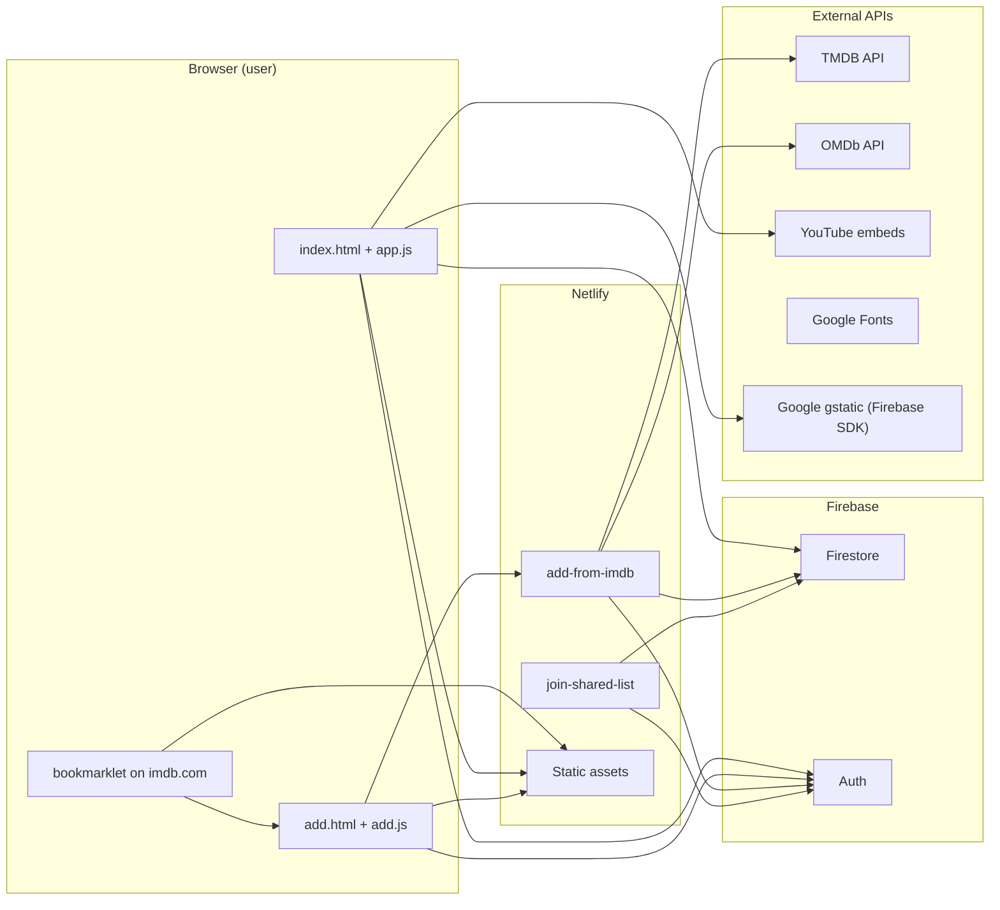
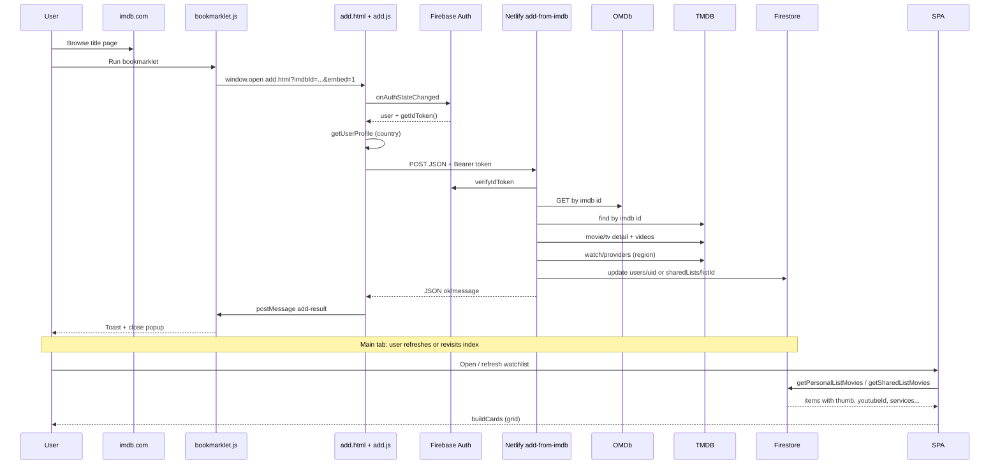
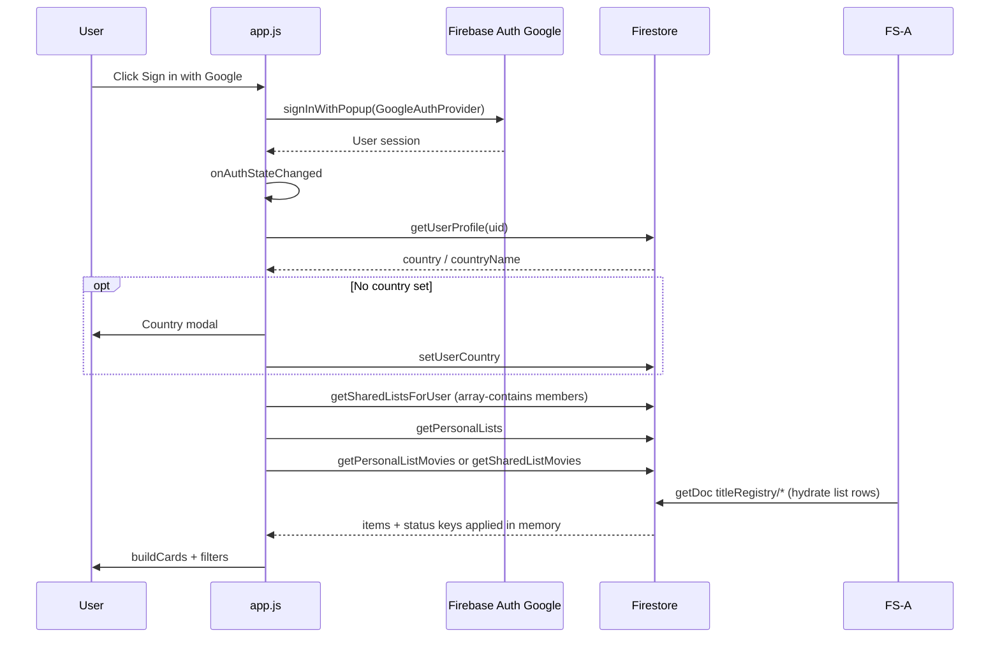
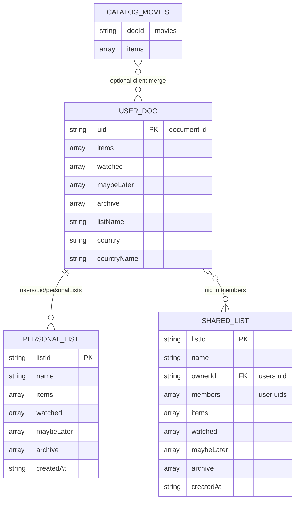
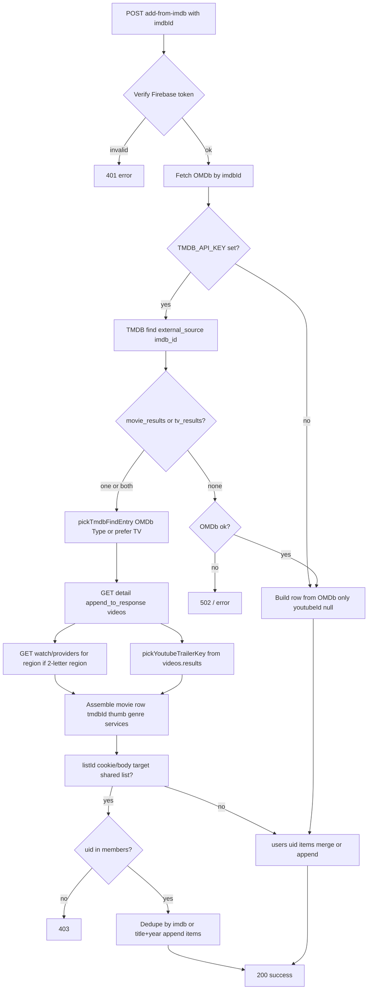

# System Design Document

This document describes **only what exists in this repository** as of the last full pass over the code (static site, Netlify functions, Firestore rules, Firebase client module, and operational scripts). It does not specify future or assumed behavior.

---

## Section 1: Services & External Dependencies

| Service name | Purpose | How it's accessed | Authentication | Environment variables |
|--------------|---------|-------------------|----------------|----------------------|
| **Firebase (Firestore)** | Persist watchlists, shared lists, **`titleRegistry`**, user profile (country, list name). | **Client:** Firebase JS SDK v10.7 from `gstatic` CDN in `firebase.js` (`getFirestore`, `doc`, `getDoc`, `setDoc`, etc.). **Server:** `firebase-admin` in Netlify functions and Node scripts. | **Client:** Firebase Auth user JWT (SDK attaches to requests per Firestore rules). **Server:** Service account JSON (base64) for Admin SDK. | **Client:** None — public web config lives in `config/firebase.js` (imported by `firebase.js`; see Section 7). **Server/scripts:** `FIREBASE_SERVICE_ACCOUNT` (base64 JSON). Scripts may also use `serviceAccountKey.json` in project root (per README / `check-upcoming.mjs`). |
| **Firebase Auth** | Google Sign-In for end users. | **Client:** `firebase-auth.js` from CDN — `signInWithPopup`, `GoogleAuthProvider`, `onAuthStateChanged`. | OAuth via Google; Firebase-issued ID tokens. | Same as Firebase — `config/firebase.js`. |
| **Firebase Analytics** | Analytics instance created on app init. | **Client:** `getAnalytics(app)` in `firebase.js`. | Inherits Firebase web app setup. | Defined in `config/firebase.js`. |
| **The Movie Database (TMDB)** | Resolve IMDb id → TMDB id; poster; genres/year; **YouTube trailer key** from appended `videos`; **watch providers** by region. | **REST:** `https://api.themoviedb.org/3/...` via Node `https.get` in `netlify/functions/add-from-imdb.js`. Same pattern in maintenance scripts (e.g. `scripts/sync-services-from-tmdb.js`, `check-upcoming.mjs` uses `fetch`). **Not** called from the browser in `app.js`. | API key query parameter `api_key`. | `TMDB_API_KEY` in Netlify env; `.env` for local scripts / `check-upcoming.mjs`. |
| **OMDb** | Title metadata by IMDb id; disambiguate movie vs TV when TMDB returns both; fallback row when TMDB has no match. | **REST:** `https://www.omdbapi.com/?i=...&apikey=...` in `add-from-imdb.js` and various scripts. | API key query parameter. | `OMDB_API_KEY` (Netlify + local scripts per README / `.env.example`). |
| **YouTube** | Trailer playback in modal via iframe embed. | **Browser:** `https://www.youtube-nocookie.com/embed/{youtubeId}?...` and link to `youtube.com/watch`. | None for embed (public video ids). | None. |
| **Google Fonts** | UI typography (Bebas Neue, DM Sans). | `<link href="https://fonts.googleapis.com/...">` in HTML. | None. | None. |
| **Netlify** | Host static HTML/CSS/JS; run serverless functions under `/.netlify/functions/*`. | **Browser:** `fetch` to same-origin function paths. **Functions:** Node.js handlers in `netlify/functions/*.js`. | Functions verify Firebase ID token (cookie or `Authorization: Bearer`). | `FIREBASE_SERVICE_ACCOUNT`, `OMDB_API_KEY`, `TMDB_API_KEY` documented in README. |

**Note:** `.env.example` includes `WATCH_REGION` for backfill scripts; the **live add flow** uses the signed-in user’s Firestore `country` (via `getUserProfile` in `add.js`), not `WATCH_REGION`, when calling the Netlify function.

---

## Section 2: Architecture Overview

**Browser (client-side)**  
- Serves as a mostly static “single page” experience: `index.html` loads `app.js` (ES module), `styles.css`, and Google Fonts.  
- `firebase.js` initializes Firebase App, Auth, Firestore, and Analytics using CDN modules.  
- `app.js` drives the watchlist UI: list selector, filters, cards, modal with YouTube iframe, sign-in UI, list management modals, country picker (data from `countries.js`).  
- All Firestore reads/writes for normal usage happen **from the client** with the end user’s Firebase Auth session, subject to `firestore.rules`.  
- `add.html` + `add.js` run a small flow for bookmarklet/embed: wait for auth, POST to `/.netlify/functions/add-from-imdb` with `Authorization: Bearer <idToken>`, show result; optionally `postMessage` to opener/parent.  
- `bookmarklet.js` (hosted on the site) is injected on **imdb.com**; it opens the hosted `add.html` in a popup and listens for `postMessage` results. Hardcodes production origin `https://watchlist-trailers.netlify.app` for the add URL and message origin checks.

**Netlify**  
- **Static hosting** for HTML, CSS, JS, SVG assets.  
- **Serverless functions** (see `netlify.toml` → `functions = "netlify/functions"`):  
  - `add-from-imdb.js` — verifies token, calls OMDb/TMDB, writes Firestore via Admin SDK; after a successful add with `tmdbId`, runs **upcoming alerts** sync for that title (`lib/sync-upcoming-alerts.js`).  
  - `join-shared-list.js` — verifies token, adds caller’s uid to `sharedLists/{listId}.members`.  
  - `check-upcoming.js` — **scheduled** (3:00 UTC, `netlify.toml` → `[functions."check-upcoming"]`): reads **`titleRegistry`** only, dedupes by TMDB id + tv/movie, calls TMDB (`/tv`, `/movie`, `/collection`), upserts `upcomingAlerts` via Admin SDK (250ms between TMDB calls, 429 → 10s retry once).  
- Functions use **Firebase Admin** with `FIREBASE_SERVICE_ACCOUNT`; they bypass Firestore security rules by design.
- **`netlify/functions/package.json`** sets `"type": "commonjs"` so handlers stay CommonJS while the repo root `package.json` is `"type": "module"`.

**Firebase**  
- **Authentication:** Google provider; users identified by `uid`.  
- **Firestore:** Collections documented in Section 3. Rules in `firestore.rules`: **`titleRegistry` read for signed-in users, no client writes**; `users/{uid}` and `users/{uid}/personalLists/*` scoped to owner; `sharedLists` readable/writable only by members (with create requiring creator in `members`); `upcomingAlerts` read for any signed-in user, no client writes. (Legacy **`catalog`** is removed from rules; delete leftover docs with `scripts/delete-legacy-catalog.mjs`.)

**External APIs — where invoked**  
- **TMDB / OMDb:** from **`netlify/functions/add-from-imdb.js`** (POST) and from **local Node scripts**, not from the deployed SPA.  
- **YouTube:** browser loads embed URLs; no YouTube Data API key in repo.  
- **No** TMDB calls from `app.js` for watch providers or enrichment at runtime; chips use data already on each item (`services`, `servicesByRegion`).

---

## Section 3: Data Model

### `catalog` (**removed**)

Legacy collection is **not** used by the app or scripts anymore. **Rules** no longer include `catalog`. Remove any remaining documents with `node scripts/delete-legacy-catalog.mjs --write` (after backup).

---

### `titleRegistry` / `{registryId}`

Canonical metadata per title (one doc per stable id). **Writes:** Admin SDK only (`add-from-imdb`, migration scripts). **Reads:** Any signed-in user.

| Field | Type | Notes |
|-------|------|--------|
| (same as former embedded item) | | `title`, `year`, `type`, `genre`, `thumb`, `youtubeId`, `imdbId`, `tmdbId`, `tmdbMedia`, `services`, … |

**`registryId` algorithm:** `lib/registry-id.js` — prefer normalized IMDb id (`tt…`), else `tmdb-tv-{id}` / `tmdb-movie-{id}`, else deterministic `legacy-{hash}` from `title|year`.

**List rows** in `users` / `sharedLists` / `personalLists` store **`{ registryId: "<id>" }`** only (after migration). Status arrays use the same string as the key (`registryId`). Per-user display overrides can attach here or on list rows in a future version.

---

### `users` / `{uid}`

| Field | Type | Notes |
|-------|------|--------|
| `items` | `array` | Prefer **`{ registryId }`** per row; legacy pre-migration rows may still be full embedded objects (hydrated from **`titleRegistry`** on read; no catalog merge). |
| `watched` | `array` of string | Keys = **`registryId`** after migration; legacy = `"title|year"`. |
| `maybeLater` | `array` of string | Same as `watched`. |
| `archive` | `array` of string | Same as `watched`. |
| `listName` | `string` | Display name for default list (default `"My list"`). |
| `country` | `string` | ISO 3166-1 alpha-2 (e.g. `"IL"`) for TMDB watch region when adding titles. |
| `countryName` | `string` | Human-readable country name for UI. |
| `upcomingDismissals` | `map` | Optional. Keys = alert **fingerprints** (e.g. `136311_3_9`, `12345_sequel_999`); values = ISO date string when the user dismissed that pill. Used so dismissed upcoming notifications stay hidden until a new fingerprint appears. |

**Relationship:** Parent for subcollection `personalLists`. Referenced by `sharedLists.members` and `sharedLists.ownerId`.

**Queries / access:** `doc(db, "users", uid)` get/set; no compound queries on `users` in client code beyond single-doc read.

---

### `users` / `{uid}` / `personalLists` / `{listId}`

| Field | Type | Notes |
|-------|------|--------|
| `name` | `string` | List name. |
| `items` | `array` | Same **Item object** shape as `users/{uid}.items`. |
| `watched`, `maybeLater`, `archive` | `array` of string | Status keys, same as user doc. |
| `createdAt` | `string` (ISO) | Set on create. |

**Relationship:** Same user only; `listId === "personal"` is **virtual** in app logic — default list lives on `users/{uid}`, not in this subcollection.

---

### `sharedLists` / `{listId}`

| Field | Type | Notes |
|-------|------|--------|
| `name` | `string` | |
| `ownerId` | `string` | Firebase `uid` of creator. |
| `members` | `array` of string | Uids with access; creator included on create. |
| `items` | `array` | **Item objects** (no `status` stored in Firestore; status derived from key sets). |
| `watched`, `maybeLater`, `archive` | `array` of string | Same pattern as user doc. |
| `createdAt` | `string` (ISO) | |

**Relationship:** Many-to-many via `members` (users can be in multiple lists).

**Indexed / queried:** Client uses `query(collection(db, "sharedLists"), where("members", "array-contains", uid))` in `getSharedListsForUser`. **No `firestore.indexes.json`** is present in repo; Firebase may auto-index simple `array-contains` queries or prompt in console if needed.

---

### `upcomingAlerts` / `{docId}`

Top-level collection. **Writes:** Admin SDK only (`check-upcoming` scheduled function, `add-from-imdb` single-title sync). **Reads:** Any signed-in user (`firestore.rules`).

Document id examples: `tv_136311_3_9`, `mv_12345_sequel_67890`. Fields include:

| Field | Type | Notes |
|-------|------|--------|
| `catalogTmdbId` | `number` | TMDB id of the catalog row this alert was built from (same as list item after merge). |
| `media` | `"tv"` \| `"movie"` | Matches list classification (`show` → tv). |
| `fingerprint` | `string` | Dismissal / identity key (e.g. `136311_3_9`, `12345_sequel_999`, `12345_upcoming`). |
| `tmdbId` | `number` | Same as `catalogTmdbId` in current implementation (show in list). |
| `type` | `"tv"` \| `"movie"` | Same as `media`. |
| `alertType` | `string` | `new_episode`, `new_season`, `upcoming_movie`, `sequel`. |
| `title`, `detail` | `string` | UI copy. |
| `airDate` | `string` or null | `YYYY-MM-DD` when known; null for TBA-style. |
| `confirmed` | `bool` | `false` for returning series without `next_episode_to_air`. |
| `expiresAt` | `string` | `YYYY-MM-DD`; expired docs deleted by the scheduled job. |
| `sequelTmdbId` | `number` or null | For `sequel` alerts. |
| `detectedAt` | `timestamp` | Server time on upsert. |

**Client:** `firebase.js` → `fetchUpcomingAlertsForItems` (chunks `catalogTmdbId` `in` queries), `dismissUpcomingAlert` merges into `users/{uid}.upcomingDismissals`. `app.js` shows pills for the **currently loaded list** only, max 3 + expand, sorted by `airDate`.

**Admin queries:** Composite `(catalogTmdbId, media)` may be required for `deleteStaleAlertsForRow`; Firebase console may prompt to create an index on first scheduled run.

---

### List row in Firestore (`items` array)

**Current (normalized):** `{ "registryId": "tt1234567" }` (or `tmdb-tv-…` / `legacy-…`). Metadata lives in **`titleRegistry/{registryId}`**; the client merges on read (`firebase.js` → `hydrateListItemsFromRegistry`).

**Legacy (pre-migration):** full embedded objects with the same fields as **`titleRegistry`** docs; still supported until `scripts/migrate-to-title-registry.mjs` is run.

**Registry / hydrated fields** (from `titleRegistry` or legacy embed):

| Field | Type | Notes |
|-------|------|--------|
| `registryId` | `string` | Present on hydrated client objects; not stored in `titleRegistry` payload (doc id is the id). |
| `title` | `string` | |
| `year` | `number` or null | |
| `type` | `"movie"` \| `"show"` | TV uses `"show"`. |
| `genre` | `string` | Often `"Genre1 / Genre2"`. |
| `thumb` | `string` (URL) or null | TMDB poster or OMDb poster. |
| `youtubeId` | `string` or null | Must match 11-char pattern to be “playable” (`lib/youtube-trailer-id.js`). |
| `imdbId` | `string` | Normalized with `tt` prefix in add flow. |
| `tmdbId` | `number` | When TMDB enrichment succeeds. |
| `services` | `array` of string | Provider display names for a region (legacy / default). |
| `servicesByRegion` | `object` | Optional map `{ "IL": [...], ... }`; may be populated by maintenance scripts or future client code (not written by current SPA). |
| `tmdbMedia` | `string` | `"tv"` \| `"movie"` for TMDB dedupe / upcoming sync. |

**Runtime-only:** `status` (`to-watch` \| `watched` \| `maybe-later` \| `archive`) is **computed in memory** when loading lists, from `watched` / `maybeLater` / `archive` key arrays (`listKey` / `registryId`).

---

## Section 4: User Flows

### 1. Sign in flow

1. User opens `index.html` on the deployed or local origin.  
2. User clicks “Sign in with Google”.  
3. `app.js` calls `signInWithPopup(auth, GoogleAuthProvider)` (custom parameter `prompt: "select_account"`).  
4. Firebase Auth completes Google OAuth; `onAuthStateChanged` fires with a user.  
5. `updateAuthUI` shows avatar UI; `init()` handler continues: loads `getUserProfile`, may force **country modal** if `country` missing, loads `getSharedListsForUser`, `getPersonalLists`, resolves `?join=` or last list from URL/localStorage.  
6. `loadList` reads personal or shared list from Firestore via `getPersonalListMovies` / `getSharedListMovies`.  
7. `buildCards()` renders grid; filters restored from `localStorage` per uid.

### 2. Add title via IMDb bookmarklet flow

1. User drags bookmarklet from `bookmarklet.html` (bookmark is a `javascript:` URL that injects `bookmarklet.js` from the deployed origin).  
2. On an IMDb title page, user runs bookmarklet: validates pathname `/title/ttxxxx`.  
3. Script opens popup to `{site}/add.html?imdbId=...&embed=1` (production URL hardcoded in `bookmarklet.js`).  
4. `add.js` validates IMDb id; subscribes to `onAuthStateChanged`.  
5. If not signed in: show error; `postMessage` to parent/opener; optionally close popup.  
6. If signed in: read `getUserProfile` for `watch_region`; read optional `listId` from cookie `bookmarklet_list_id` (set from main app when a **shared** list is active).  
7. `fetch("/.netlify/functions/add-from-imdb", { POST, Authorization: Bearer <getIdToken()> })` with body `{ imdbId, watch_region, listId? }`.  
8. Netlify function verifies token → `uid`; loads OMDb; if `TMDB_API_KEY` present, runs TMDB find + detail + videos + watch providers; else falls back to OMDb-only row; writes to `sharedLists/{listId}` or `users/{uid}` per Section 4 continuation.  
9. Response JSON returned; `add.js` displays message; `postMessage({ type: "add-result", ... })` to opener/parent; bookmarklet shows toast and closes popup.  
10. **Main watchlist tab does not automatically reload** from this flow; user refreshes or revisits to see new titles (unless they were already polling — they are not).

### 3. TMDB enrichment flow (add path)

**Implemented in** `netlify/functions/add-from-imdb.js` (POST) and conceptually:

1. Normalize IMDb id to `tt…`.  
2. Fetch OMDb by id (for type hint and fallback body).  
3. If `TMDB_API_KEY` set: **find** `/find/{imdb_id}?external_source=imdb_id`.  
4. Choose movie vs TV via `pickTmdbFindEntry` (OMDb `Type`, else prefer TV if both exist).  
5. **Detail** `/{movie|tv}/{id}?append_to_response=videos` → poster, title, year, genres, `videos.results`.  
6. Pick YouTube key: prefer Trailer → Teaser → Clip/Featurette → any YouTube on TMDB.  
7. If watch region present (2-letter): **watch providers** `/{type}/{id}/watch/providers`, flatten `flatrate`/`rent`/`buy` names for that region.  
8. If TMDB fails: build minimal row from OMDb only (`youtubeId: null`).  
9. Dedupe/merge into target list document; normalize `youtubeId` through 11-char validation before persist.

### 4. Shared list invite flow

**Create:**  
1. Signed-in user opens list settings modal → “Create shared list”, enters name.  
2. `createSharedList(uid, name)` writes `sharedLists/{listId}` with `ownerId`, `members: [uid]`, empty arrays.  
3. Modal shows URL `?join={listId}` and copy button.

**Join via link:**  
1. User opens site with `?join={listId}` while signed in.  
2. `app.js` `POST`s `/.netlify/functions/join-shared-list` with JSON `{ listId }`, `credentials: "include"` (cookie `bookmarklet_token` may be sent, or logic also supports Bearer — join function reads cookie or `Authorization` header).  
3. Function verifies Firebase ID token, `arrayUnion(uid)` on `members` if not already present.  
4. Client refreshes shared lists, switches `currentListMode` to that shared list.

**Join via paste:**  
- Lists modal “Join” reads URL from input, extracts `join` query param, same POST as above.

**Copy invite (header):**  
- When viewing a shared list, “Copy invite link” copies `origin + pathname + "?join=" + listId`.

### 5. Watch provider lookup flow

1. **At add time:** User’s `country` on `users/{uid}` is read in `add.js` as `watch_region` and sent to `add-from-imdb`.  
2. **Server:** `enrichFromTmdb` fetches TMDB watch providers for that region and stores provider **names** on the new/merged item as `services` (array of strings).  
3. **At display time:** `app.js` `servicesForMovie(m, userCountryCode)` prefers `m.servicesByRegion[countryCode]`, else falls back to `m.services`.  
4. **Persisting region-specific cache:** There is no client helper in the SPA; `services` / `servicesByRegion` are set at add time (Netlify) or by scripts, not by `app.js`.

---

## Section 5: Component Map

| Name / file | Responsibility | Reads Firestore | Writes Firestore | External APIs |
|-------------|----------------|-----------------|------------------|---------------|
| `index.html` | Shell markup, modals, header, grid container. | — | — | Google Fonts |
| `app.js` | Watchlist UI, auth chrome, list switching, modal, filters, invite copy/join, bookmarklet link builder. | Via `firebase.js` helpers (`getPersonalListMovies`, `getSharedListMovies`, `setStatus`, etc.) | Same | `fetch` → `join-shared-list`; YouTube embed URLs; clipboard API |
| `config/firebase.js` | Public Firebase Web SDK config object (`firebaseConfig`). | — | — | — |
| `firebase.js` | Imports config, initializes App/Auth/Firestore/Analytics; **`titleRegistry`** hydration, user/shared/personal list CRUD, status keys. | `titleRegistry`, `users/*`, `sharedLists/*`, `personalLists/*` | Same | Firebase SDK only (Gstatic CDN) |
| `countries.js` | Static ISO country list + flags for country modal. | — | — | — |
| `lib/youtube-trailer-id.js` | Validate/normalize TMDB YouTube key strings. | — | — | — |
| `add.html` | Minimal page for add result. | — | — | — |
| `add.js` | Bookmarklet target: auth gate, call add function. | `getUserProfile` | — | `fetch` → `add-from-imdb` |
| `bookmarklet.html` | Instructions + draggable bookmark. | — | — | — |
| `bookmarklet.js` | On IMDb: open popup, `postMessage` handshake. | — | — | Opens hosted `add.html` (hardcoded Netlify host) |
| `netlify/functions/add-from-imdb.js` | Auth verify, OMDb/TMDB enrichment, merge/write list docs. | Firestore via Admin | `users`, `sharedLists` | OMDb, TMDB |
| `netlify/functions/join-shared-list.js` | Add member to shared list. | Firestore via Admin | `sharedLists` | — |
| `styles.css` | Visual styling. | — | — | — |
| `check-upcoming.mjs` | Local diagnostic: read Firestore + TMDB, print report. | Admin + `dotenv` | — | TMDB |
| `scripts/*.js` | Maintenance, backup, migration (titleRegistry model). | Admin (typical) | Varies | TMDB, OMDb, etc. |

---

## Section 6: Mermaid Diagrams

### System context (context diagram)

### IMDb bookmarklet → TMDB enrichment → card (sequence diagram)

### Sign in → watchlist load (sequence diagram)

### Firestore ER (entity relationship)

### TMDB enrichment decision logic (flowchart)

---

## Section 7: Open Questions & Gaps

1. **Web app config:** Public Firebase web SDK settings live in **`config/firebase.js`** and are imported by `firebase.js`. They are not loaded from `.env` (static site, no build step).

2. **Secrets in repository:** Full Firebase web config (including `apiKey`) is committed. This is normal for Firebase client apps but means the document is not “secret-free”; `FIREBASE_SERVICE_ACCOUNT` correctly stays out of git.

3. **Bookmarklet portability:** `bookmarklet.js` and `bookmarklet.html` hardcode **`https://watchlist-trailers.netlify.app`** for the script URL and popup base. Forks or alternate deployments must edit these files.

4. **Secondary personal lists + bookmarklet:** Cookie `bookmarklet_list_id` is set when viewing a **shared** list, not when viewing an extra **personal** subcollection list. The Netlify function only targets `users/{uid}.items` or `sharedLists/{listId}` — **bookmarklet cannot add directly** to `users/.../personalLists/{otherListId}`.

5. **Firestore rules vs Admin:** Client rules deny **`titleRegistry`** writes; list mutations from functions use **Admin SDK** (bypass rules). Compromise of `FIREBASE_SERVICE_ACCOUNT` on Netlify is full database access.

6. **Shared list join token:** Join uses the same `bookmarklet_token` cookie / Bearer token as add; there is **no separate invite secret** — anyone with a valid account and a `listId` could join if they guess/obtain the id (predictability of random ids should be considered).

7. **`join-shared-list` CORS headers:** Response includes `Access-Control-Allow-Origin` reflecting request origin; **POST from browser** with credentials is how `app.js` uses it; behavior depends on Netlify origin alignment.

8. **Composite indexes:** `array-contains` query on `sharedLists` has **no committed `firestore.indexes.json`**; if Firebase ever requires a composite index for an expanded query, it would be created in console only.

9. **`hideCountryModal` / `countryModalResolve`:** `app.js` contains `hideCountryModal` assigning `countryModalResolve = null` — small dead/legacy fragment next to `showCountryModal` Promise flow (Country save uses `saveBtn.onclick` path).

10. **“Recently Added” tab:** Driven by **order of items in the loaded array** (last N in array), not a server-side `addedAt` field — reordering or merge logic can change meaning without a timestamp.

---

*End of document.*
